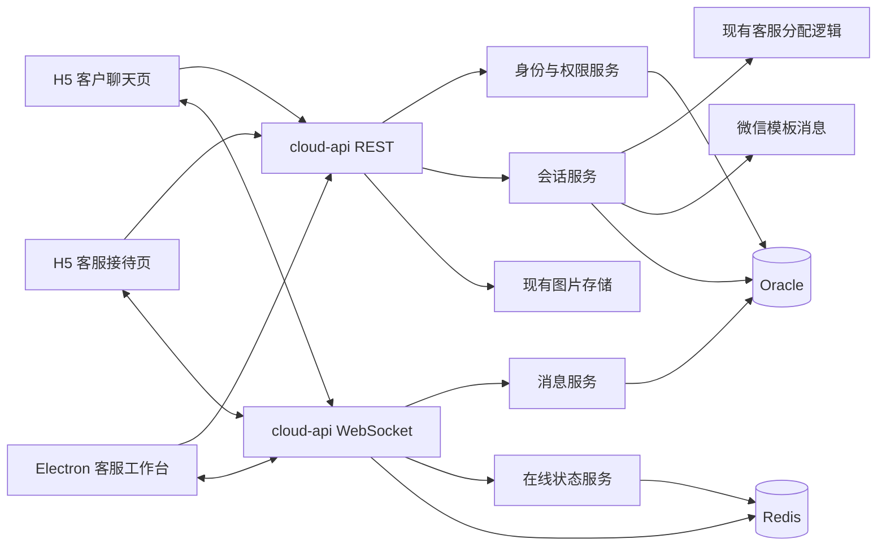

# 链辽真人客服系统设计

- 日期：2026-07-17
- 状态：设计已确认，等待规格审阅
- 涉及项目：`AionUi`、`vip_store`、`cloud-service/cloud-api`

## 1. 背景与目标

链上辽宁现有 H5 已具备微信公众号 `openId` 获取、企业用户查询、客服分配、图片上传和微信模板消息能力，但没有完整的真人即时客服系统。链辽桌面端也尚未具备客服人员接待工作台。

本次建设一套自有 WebSocket 真人客服系统，实现：

1. H5 客户发起真人咨询、恢复未结束会话、发送文本和图片、查看历史记录并结束会话。
2. H5 客服人员通过微信模板消息进入移动接待工作台，完成回复、转接和结束会话。
3. Electron 客服人员通过链辽AI桌面工作台进行高效率接待，并获得桌面消息提醒。
4. `cloud-api` 统一提供身份认证、会话、消息、分配、上传、推送和 WebSocket 能力。
5. Oracle 保存完整业务数据，Redis 保存短期令牌、在线状态、连接路由和跨实例广播信息。

## 2. 范围

### 2.1 首版包含

- 文本消息、图片消息和必要的系统消息。
- 客户和客服双方主动结束会话。
- 24 小时无消息自动结束会话。
- 客服指定转接给另一名有效客服。
- 新分配和转接后的微信提醒。
- 消息送达确认、已读进度、未读数量、断线重连和缺失消息补拉。
- H5 客户页、H5 客服接待页和 Electron 客服工作台。
- Electron 桌面通知、托盘未读状态和点击通知定位会话。

### 2.2 首版不包含

- 文件、语音、视频消息。
- 机器人与真人客服自动切换。
- 群聊、多人同时回复同一会话。
- 独立客服管理后台、质检、满意度评价和统计报表。
- 在现有 H5 页面增加真人客服入口按钮。首版只提供可直接访问的客户路由。

## 3. 已确认的业务规则

### 3.1 客户身份

- H5 客户身份使用微信公众号 `openId`。
- `openId` 允许明文传输，但不能直接作为 WebSocket 写权限凭证。
- 客户先通过 REST 接口使用 `openId` 换取短期访问令牌，再使用一次性票据建立 WebSocket。
- 客户只能查看和操作自己的会话。

### 3.2 客服身份与权限

- H5 前端继续通过现有 `getScysUserDetail` 数据中的 `roleId` 控制客服页面入口。
- 前端只有在 `roleId = 19` 时展示和进入客服接待页面。
- 前端判断只负责界面门禁，不能作为真实写权限。
- 后端签发客服令牌时必须重新查询并同时满足：
  - `J_USER_ROLE_RELATIVE.ROLE_ID = 19`；
  - `LS_PUBLIC_USER.POST = '客服'`；
  - 用户和企业关联处于有效状态。
- 所有客服 REST 写接口和 WebSocket 命令必须验证后端令牌、当前会话归属和会话状态。
- 当前客服具有回复、转接和结束权限；转出后的原客服仅保留历史只读权限。

### 3.3 客服分配

- 新会话复用 `cloud-api/YlsbUser/getAllocationKeFuUserInfo` 背后的现有业务逻辑，不复制分配规则。
- 分配参数使用：

```json
{
  "user_name": "客户显示名称",
  "tel": "客户电话",
  "from_company_name": "客户企业名称"
}
```

- 现有分配逻辑依次考虑推广登记、推广注册、历史回访、企业确认、担保关系和顺序分配。
- `user_name` 当前不参与分配计算，但需要保存为客户显示快照。
- 分配结果必须再次验证客服满足 `roleId = 19 AND POST = '客服'`。
- 恢复未结束会话时不重新调用分配接口，继续使用原客服。
- 分配失败或返回无效客服时，会话进入 `WAITING`，客户仍可留言；后台每 5 分钟重新尝试分配。
- 只有会话结束或当前客服失效时，才允许重新分配。

### 3.4 转接

- 首版采用指定转接，不自动退回分配队列。
- 候选人员只包含同时满足角色和岗位条件的客服。
- 列表展示在线状态和当前进行中会话数量，在线人员优先。
- 允许转接给离线客服，但必须在界面明确提示。
- 转接成功后原客服失去写权限，新客服获得写权限，并生成系统消息和转接记录。
- 转接后向新客服推送一次微信提醒。

### 3.5 会话结束

- 客户和当前客服都可以主动结束会话。
- 会话结束后双方只能查看历史，不能继续发送消息。
- 后台每 5 分钟扫描一次，以最后消息时间为准，自动关闭连续 24 小时无消息的会话。
- 会话结束后客户再次咨询会创建新会话并重新分配。

## 4. 总体架构

采用 `cloud-api + Oracle + Redis` 的可扩展 WebSocket 架构，使用 Spring `TextWebSocketHandler` 和自定义 JSON 协议，不使用第三方即时通信平台。



### 4.1 后端组件边界

| 组件 | 单一职责 |
|---|---|
| `CustomerServiceAuthService` | 查询客户或客服身份、签发短期令牌、签发一次性 WebSocket 票据 |
| `CustomerServiceConversationService` | 创建、恢复、分配、转接、结束和超时关闭会话 |
| `CustomerServiceMessageService` | 校验、幂等保存、查询消息并维护已读进度 |
| `CustomerServiceAssignmentAdapter` | 调用现有客服分配业务并验证返回客服资格 |
| `CustomerServicePresenceService` | 维护连接、在线状态、心跳和客服工作量快照 |
| `CustomerServiceNotificationService` | 创建微信推送任务、执行发送和有限重试 |
| `CustomerServiceUploadService` | 校验图片并代理到现有文件存储服务 |
| `CustomerServiceWebSocketHandler` | 连接鉴权、协议解析、命令路由和事件下发 |

组件通过接口协作，不允许 Controller、WebSocket Handler 直接编写业务 SQL 或直接调用外部推送工具。

## 5. 数据模型

新增四张 Oracle 表。实际执行建表属于数据库修改，必须在实施阶段再次获得用户确认。

### 5.1 `J_CY_CS_CONVERSATION`

保存会话状态和客户、客服快照，核心字段包括：

- `ID`：`NUMBER(19)` 主键，服务端生成。
- `CUSTOMER_OPEN_ID`、`CUSTOMER_USER_ID`。
- `CUSTOMER_NAME`、`CUSTOMER_TEL`、`CUSTOMER_COMPANY_ID`、`CUSTOMER_COMPANY_NAME`。
- `STAFF_USER_ID`、`STAFF_OPEN_ID`、`STAFF_NAME`。
- `ALLOCATION_SOURCE`。
- `STATUS`：`WAITING`、`ACTIVE` 或 `CLOSED`。
- `LAST_MESSAGE_ID`、`LAST_MESSAGE_AT`。
- `CUSTOMER_LAST_READ_ID`、`STAFF_LAST_READ_ID`。
- `ASSIGNMENT_VERSION`：每次初始分配或转接递增。
- `VERSION`：乐观锁版本。
- `CLOSED_BY_TYPE`、`CLOSED_BY_ID`、`CLOSED_REASON`、`CLOSED_AT`。
- `ASSIGNED_AT`、`CREATED_AT`、`UPDATED_AT`、`DEL_SIGN`。

使用基于状态的函数索引保证同一 `CUSTOMER_OPEN_ID` 只能存在一个 `WAITING` 或 `ACTIVE` 会话。Redis 创建锁用于降低冲突，Oracle 唯一约束负责最终一致性。

### 5.2 `J_CY_CS_MESSAGE`

保存文本、图片和系统消息，核心字段包括：

- `ID`、`CONVERSATION_ID`。
- `CLIENT_MESSAGE_ID`：客户端生成的 UUID。
- `SENDER_TYPE`：`CUSTOMER`、`STAFF` 或 `SYSTEM`。
- `SENDER_USER_ID`、`SENDER_OPEN_ID`、`SENDER_NAME`。
- `MESSAGE_TYPE`：`TEXT`、`IMAGE` 或 `SYSTEM`。
- `TEXT_CONTENT`。
- `IMAGE_URL`、`IMAGE_WIDTH`、`IMAGE_HEIGHT`、`IMAGE_SIZE_BYTES`、`IMAGE_MIME_TYPE`。
- `CREATED_AT`、`DEL_SIGN`。

对 `(CONVERSATION_ID, SENDER_TYPE, CLIENT_MESSAGE_ID)` 建立唯一约束，实现重发幂等。

### 5.3 `J_CY_CS_ASSIGN_LOG`

保存初始分配、失败重试和人工转接历史，包含原客服、新客服、操作人、分配来源、原因、会话分配版本和创建时间。

### 5.4 `J_CY_CS_PUSH_LOG`

同时作为微信推送记录和可靠任务表，包含：

- 会话、分配版本、接收客服和 `openId`。
- 推送类型：`NEW_ASSIGNMENT` 或 `TRANSFER`。
- 数据库模板 ID，固定为 `5`。
- 唯一幂等键。
- 状态：`PENDING`、`SENDING`、`SENT` 或 `FAILED`。
- 尝试次数、下次重试时间、失败摘要和成功时间。

初次发送失败后分别在 1、5、15 分钟后重试，最多三次重试；包括初次发送在内最多四次尝试。

### 5.5 ID 规则

- 新客服业务主键由服务端 Oracle 序列生成。
- 新生成主键可以使用正常正数序列。
- 所有接口公共 ID 校验必须接受任意非零有符号整数，兼容现有负数用户、企业、产品和项目 ID。
- 客户端不得使用 JavaScript `number` 做可能超过安全整数范围的 ID 运算；接口和 TypeScript 模型使用字符串传递 64 位 ID。

## 6. 身份令牌与 WebSocket 连接

### 6.1 REST 访问令牌

- 客户通过 `openId` 换取客户令牌。
- H5 客服通过 `openId` 换取客服令牌，后端重新校验角色、岗位和有效状态。
- Electron 客服在现有扫码登录上下文基础上换取客服令牌，后端执行相同校验。
- 访问令牌使用强随机值，只在 Redis 中保存摘要和身份上下文，有效期 2 小时。
- 客户端在到期前透明重新认证；重新认证不得创建新会话或触发新微信提醒。

### 6.2 一次性 WebSocket 票据

浏览器原生 WebSocket 不能可靠设置自定义 `Authorization` 请求头，因此不能把访问令牌直接长期放在 URL 中。

流程如下：

1. 客户端携带 REST 访问令牌请求一次性票据。
2. 后端在 Redis 保存票据与身份上下文，TTL 为 60 秒。
3. 客户端连接 `wss://<domain>/cloud-api/customer-service/ws?ticket=<ticket>`。
4. 握手成功时原子消费票据；同一票据不能再次连接。

## 7. REST 接口

统一以 `/cloud-api/CustomerServiceController` 为前缀，并使用现有 `CommonResult` 响应结构。

| 方法与路径 | 作用 | 身份 |
|---|---|---|
| `POST /customer/auth` | 客户认证并返回短期令牌和客户快照 | `openId` |
| `POST /staff/auth` | 客服认证并返回短期令牌和客服快照 | `openId` 或桌面登录上下文 |
| `POST /conversation/open` | 恢复未结束会话，没有时创建并分配 | 客户令牌 |
| `POST /conversation/list` | 按状态、关键字和游标查询当前客服会话 | 客服令牌 |
| `POST /conversation/detail` | 查询有权访问的会话详情 | 双方令牌 |
| `POST /message/history` | 使用消息游标分页查询历史或补拉缺失消息 | 双方令牌 |
| `POST /message/read` | 更新当前身份的最后已读消息 | 双方令牌 |
| `POST /image/upload` | 校验并上传客服图片 | 双方令牌 |
| `POST /conversation/transfer` | 指定另一名有效客服并转接 | 当前客服令牌 |
| `POST /conversation/close` | 主动结束会话 | 客户或当前客服令牌 |
| `POST /staff/candidates` | 查询可转接客服、在线状态和进行中数量 | 当前客服令牌 |
| `POST /websocket/ticket` | 生成一次性 WebSocket 票据 | 双方令牌 |

会话列表只返回当前客服负责的会话，以及该客服参与过的已转出或已结束历史；不会向所有客服暴露全部客户会话。

## 8. WebSocket 协议

### 8.1 消息信封

所有帧均使用 UTF-8 JSON：

```json
{
  "event": "message.send",
  "requestId": "客户端请求UUID",
  "conversationId": "会话ID字符串",
  "serverTime": 0,
  "payload": {}
}
```

- 客户端发送时 `serverTime` 可省略。
- 服务端事件必须包含服务端时间。
- 协议错误返回结构化错误码，不返回 Java 异常堆栈。

### 8.2 客户端事件

| 事件 | 作用 |
|---|---|
| `message.send` | 发送文本或已上传成功的图片消息 |
| `message.read` | 提交最后已读消息 ID |
| `ping` | 应用层心跳 |

转接和结束使用 REST 事务接口，WebSocket 只广播状态结果，避免状态命令在断线重发时产生歧义。

### 8.3 服务端事件

| 事件 | 作用 |
|---|---|
| `connection.ready` | 鉴权成功并返回身份与连接信息 |
| `conversation.snapshot` | 返回当前会话状态和未读摘要 |
| `message.ack` | 表示消息已经写入 Oracle，包含服务端消息 ID |
| `message.created` | 向会话另一方广播新消息 |
| `read.updated` | 广播对方已读进度 |
| `conversation.assigned` | 等待会话分配成功 |
| `conversation.transferred` | 会话转接成功 |
| `conversation.closed` | 会话已经结束 |
| `presence.updated` | 客户或客服在线状态变化 |
| `pong` | 心跳响应 |
| `error` | 鉴权、权限、参数、状态或限流错误 |

### 8.4 一致性语义

- 每条消息先校验权限和 `clientMessageId`，再写 Oracle。
- 数据库事务提交成功后才发送 `message.ack` 和广播。
- Redis Pub/Sub 只用于实时跨实例广播，不是消息最终数据源。
- 实时广播语义为至少一次；数据库唯一约束保证消息只持久化一次。
- 客户端依据服务端消息 ID 去重和排序。

## 9. 核心流程

### 9.1 创建或恢复会话

1. H5 获取 `openId` 并完成客户认证。
2. 客户调用 `/conversation/open`。
3. 后端在 Redis 获取 `cs:conversation:create:<openId>` 短锁，并查询现有 `WAITING` 或 `ACTIVE` 会话。
4. 有未结束会话时直接返回，不重新分配，不重新推送。
5. 没有未结束会话时调用现有客服分配业务。
6. 验证分配客服资格，事务内写入会话、分配日志和待推送记录。
7. 异步推送微信提醒并建立 WebSocket。

### 9.2 发送消息

1. 客户端先在界面显示“发送中”。
2. WebSocket Handler 校验会话归属、状态、消息类型、长度和限流。
3. `CustomerServiceMessageService` 使用 `clientMessageId` 幂等保存。
4. 提交事务后向发送端返回 `message.ack`。
5. 同实例直接广播，跨实例通过 Redis 广播。
6. 客户端收到 `ack` 后显示“已送达”；超时则保留消息并允许重试。

### 9.3 断线恢复

- 客户端每 25 秒发送心跳；60 秒没有有效响应判定断线。
- 重连退避时间为 1、2、5、10、30 秒，之后保持 30 秒上限。
- 重连前重新获取一次性票据。
- 建连后使用最后收到的服务端消息 ID 调用历史接口补拉缺失消息。
- 文本待发送队列保存到当前会话本地草稿；图片只保存本地预览和失败状态，不保存二进制到长期存储。

### 9.4 转接

1. 当前客服查询有效候选人并选择目标客服。
2. 后端再次验证操作人、目标客服和当前分配版本。
3. 事务内更新当前客服、递增 `ASSIGNMENT_VERSION`、写转接日志、系统消息和新推送任务。
4. 原客服切换为只读，新客服获得写权限。
5. WebSocket 广播转接事件；新客服在线时立即收到，离线时通过微信提醒。

### 9.5 结束会话

- 结束接口要求传入当前会话版本并执行乐观锁更新。
- 重复结束返回当前已结束快照，不重复生成系统消息。
- 自动关闭任务使用 Redis 分布式锁，避免多实例重复处理。

## 10. 微信模板消息

- 通过 `weixinTemplateService.getById(5)` 获取 `WEIXIN_TEMPLATE.ID = 5` 对应的真实微信模板 ID。
- 使用现有 `PushMessageServiceImpl` / `PushMessageService.PushWXMessage(JSONObject)` 发送。
- 模板字段映射：
  - `thing1` 服务名称：`链辽真人客服`；
  - `thing5` 服务对象：客户姓名或企业名称，优先企业名称；
  - `time8` 开始时间：本次分配或转接时间。
- 模板 URL 指向 `vip_store/#/customer-service/reception?conversationId=<id>`。
- H5 页面打开后仍必须完成客服鉴权，URL 参数不能授予权限。
- 新会话初次分配推送一次；刷新、恢复和重连不推送。
- 转接后向新客服推送一次；普通后续消息不推微信。
- 推送幂等键包含会话 ID、分配版本、客服 ID 和推送类型。

## 11. 图片上传

- 复用现有 `cloud-file-upload/NoCrossOriginUpload/newwebfileupload.action` 文件存储。
- H5 和 Electron 不直接依赖该存储接口细节，统一调用新的客服上传接口。
- 支持 JPG、PNG、WebP 和 GIF。
- 单张图片最大 10 MB。
- H5 对较大 JPG、PNG 或 WebP 照片优先压缩；GIF 不做有损压缩。
- 后端同时校验扩展名、MIME 和真实文件内容，并生成随机文件名。
- 上传成功后 WebSocket 图片消息只携带受信任文件 URL 和元数据，不传输二进制。
- 上传失败不写消息表，前端保留失败状态供重试。

## 12. 客户端设计

### 12.1 H5 客户页

- 项目：`E:/ZZY_PROJECT/lianshang_liaoning/vip_store`
- 路由：`/customer-service/chat`。
- 首版不在其他页面增加入口按钮。
- 页面包含客服信息和在线状态、连接提示、消息时间线、系统消息、图片预览、固定输入区和结束咨询。
- 未注册客户仍可以通过现有微信公众号身份进入；能查询到企业资料时展示企业上下文，查不到时按普通客户处理。

### 12.2 H5 客服接待页

- 路由：`/customer-service/reception`。
- 微信模板消息点击后进入该路由并定位指定会话。
- 移动端采用会话列表和会话详情两级页面，不使用桌面三栏压缩布局。
- 会话列表支持 `待接待`、`进行中`、`已结束` 分类、客户或企业搜索、未读数和最后消息。
- 详情支持回复、图片、已读状态、转接、结束和客户企业摘要。
- 路由守卫通过现有 Store 获取用户数据并检查 `roleId = 19`；后端继续执行真实权限校验。

### 12.3 Electron 客服工作台

- 项目：`E:/ZZY_PROJECT/AI_lianliao/AionUi`。
- 使用 Ant Design React 和现有企业工作台公共样式变量。
- 布局为左侧会话队列、中间聊天区、右侧客户与企业资料三栏。
- 支持待接待、进行中和已结束筛选、搜索、未读数、快捷发送、转接和结束。
- 窗口不在前台或最小化到托盘时，新客户消息触发系统通知和托盘未读状态。
- 点击系统通知恢复并聚焦窗口，直接选中对应会话。
- 工作台保留返回“链上辽宁·产业云城”和进入“链辽AI”的既有导航能力。

### 12.4 统一交互与视觉

- 字体优先使用微软雅黑：`Microsoft YaHei, PingFang SC, sans-serif`。
- 使用亮色白底、品牌蓝、15px 圆角和轻阴影。
- 界面的“待接待”是派生队列：表示已经分配给当前客服、但客服尚未发送第一条回复的 `ACTIVE` 会话；界面的“进行中”表示客服已经回复的 `ACTIVE` 会话。
- 数据库中的 `WAITING` 表示尚未成功分配客服，不展示给某一个客服；分配成功后才进入该客服的“待接待”队列。
- 消息状态包括发送中、已送达和发送失败。
- 用户查看较早历史时不强制滚动到底部，而显示“有新消息”按钮。
- 只有在用户已接近底部时，新消息自动滚动到最新位置。
- 列表和消息区必须在固定工作区内独立滚动，不能拉长整体页面。

## 13. 异常处理与安全

### 13.1 异常处理

- 分配失败：保留 `WAITING` 会话和客户留言，定时重试。
- 微信失败：不回滚会话，使用推送任务重试并记录失败摘要。
- Oracle 保存失败：不返回 `ack`，客户端保留消息并允许使用原 `clientMessageId` 重试。
- Redis 广播失败：已提交消息仍然有效；对端重连后通过 Oracle 补拉。
- WebSocket 不可用：页面明确显示连接异常，不把未提交消息伪装为发送成功。
- 图片失败：不创建消息，允许重新上传。
- 并发转接或结束：通过事务、分配版本和乐观锁拒绝过期操作，并返回最新会话快照。

### 13.2 输入与访问控制

- 文本消息最长 2000 个 Unicode 字符。
- 文本按纯文本保存和渲染，不接受客户端 HTML。
- 单个身份每分钟最多发送 30 条消息，其中图片最多 10 条；超过限制返回明确限流错误。
- 图片 URL 必须来自配置的受信任上传域名。
- 客户只能操作自己 `openId` 关联的会话。
- 客服只能回复当前分配给自己的 `ACTIVE` 会话。
- 转出客服只能查看其参与过的历史，不能继续发送。
- 日志不记录访问令牌、票据、完整 `openId`、完整手机号或完整消息正文。

## 14. Redis 设计

使用统一 `cs:` 前缀：

- `cs:access:<tokenDigest>`：访问令牌上下文，TTL 2 小时。
- `cs:ws:ticket:<ticketDigest>`：一次性票据，TTL 60 秒。
- `cs:connection:<connectionId>`：连接身份和实例路由，随心跳续期。
- `cs:online:customer:<openIdDigest>`、`cs:online:staff:<staffId>`：在线状态。
- `cs:conversation:create:<openIdDigest>`：创建会话短锁。
- `cs:scheduler:auto-close`、`cs:scheduler:push-retry`：分布式任务锁。
- `cs:pubsub:events`：跨实例事件广播频道。

Redis 中涉及 `openId` 的 Key 使用摘要，不直接暴露完整值。

## 15. 部署与配置

1. 在测试库审阅并执行四张表、序列、索引和约束脚本。
2. 在 `cloud-api` 增加 WebSocket 依赖和客服模块配置。
3. 配置 Redis Key 前缀、令牌 TTL、心跳、限流、上传域名和功能开关。
4. Nginx 为 `/cloud-api/customer-service/ws` 配置 `Upgrade`、`Connection` 和长连接超时，并在生产使用 `wss://`。
5. 先部署后端并完成接口与 WebSocket 联调，再部署 H5 两个直接路由。
6. 最后部署 Electron 客服工作台和桌面通知。
7. 客服模块使用功能开关；开发和测试环境先启用，生产确认后启用。

数据库建表、索引或存量数据修改在执行前必须再次获得用户明确确认。

## 16. 测试策略

### 16.1 后端

- 客户和客服身份签发、角色与岗位组合校验。
- 普通用户伪造 `roleId`、`openId`、会话 ID 和客服 ID 的拒绝测试。
- 创建锁和数据库唯一约束下的并发开会话测试。
- 现有分配逻辑复用、无效客服回退到 `WAITING`、恢复不重分配。
- 文本和图片校验、消息幂等、事务提交后广播。
- 已读进度、未读数量、转接和结束状态机。
- 24 小时自动结束和多实例任务锁。
- 微信推送幂等、失败重试和普通消息不推送。
- Redis 多实例广播、断线补拉和 Redis 暂时不可用恢复。

### 16.2 H5

- 客户页面创建、恢复、发送、失败重试、图片和结束会话。
- 客服页面前端角色门禁、列表、搜索、未读、回复、转接和结束。
- 微信链接定位会话及无权限页面。
- 移动端安全区、软键盘、独立滚动和历史消息滚动位置。
- TypeScript 类型检查、Vue 构建和关键交互自动化测试。

### 16.3 Electron

- 客服身份路由、会话三栏布局、独立滚动和窗口缩放。
- WebSocket 重连、消息去重、未读更新和草稿。
- 系统通知、托盘未读、点击通知定位会话。
- 单元测试、TypeScript 类型检查、构建和关键工作台端到端测试。

## 17. 验收标准

1. 非 `roleId = 19 AND POST = '客服'` 用户无法通过 REST 或 WebSocket 回复、转接或结束客服会话。
2. 同一客户重复进入时恢复原未结束会话和原客服，不重复推送。
3. 同一 `clientMessageId` 重复发送只产生一条数据库消息。
4. 数据库提交失败时客户端不会显示已送达。
5. 断线后能够自动重连并补齐缺失消息，不出现重复展示。
6. 新会话分配和转接各只向对应新客服推送一次微信提醒。
7. 普通聊天消息不触发微信模板消息。
8. 转接后原客服立即失去写权限，新客服能够继续会话。
9. 客户或客服结束后双方都不能继续发送；24 小时无消息会话能够自动结束。
10. H5 客户、H5 客服和 Electron 客服端的列表、消息区均独立滚动，不拉长整体页面。
11. 图片类型、大小和内容校验有效，失败可以重试且不会生成空消息。
12. Electron 在后台或托盘状态能够收到桌面提醒并定位对应会话。

## 18. 实施边界与顺序

实施分为五个可独立验证的阶段：

1. `cloud-api` 数据模型、身份、会话、消息、分配适配、推送任务和测试。
2. WebSocket、Redis 在线状态、跨实例广播和 Nginx 配置示例。
3. `vip_store` H5 客户聊天页和直接路由。
4. `vip_store` H5 客服接待页及微信模板跳转。
5. `AionUi` Electron 客服工作台、桌面通知和完整联调。

三个项目当前均可能存在用户未提交改动。实施时只修改客服功能相关文件；任何与用户改动重叠的文件必须先核对差异，禁止覆盖或清理无关改动。
