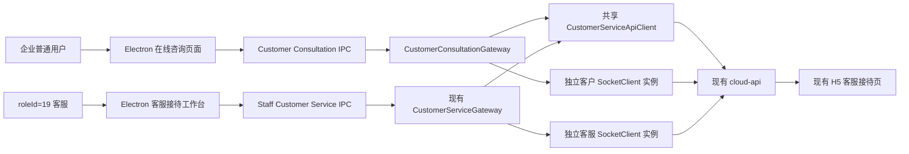
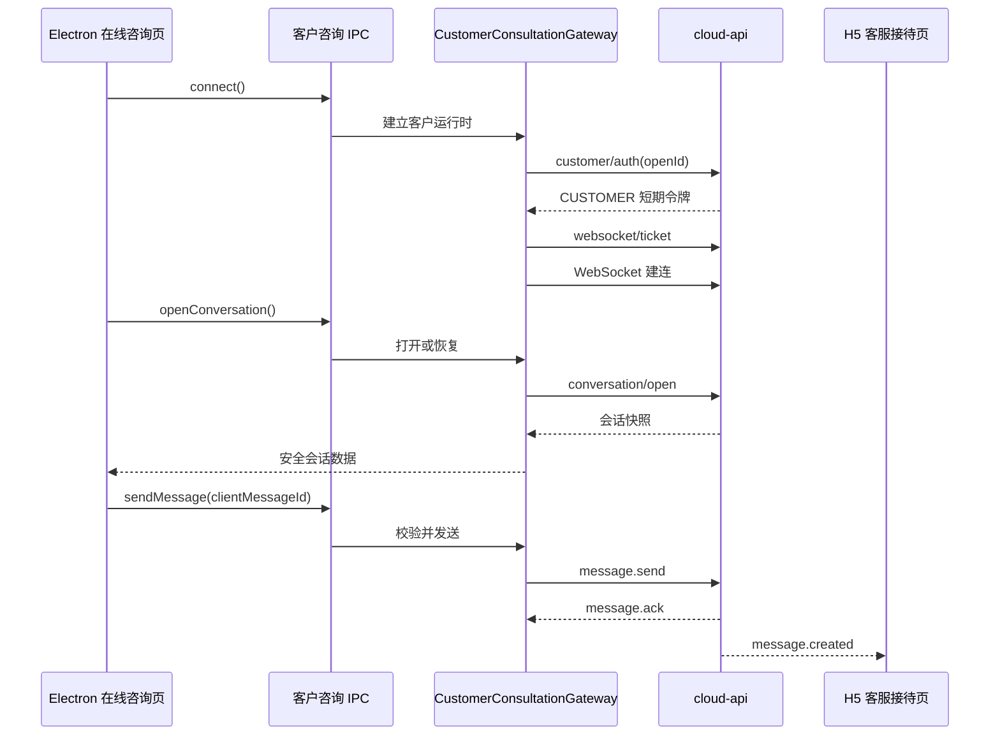

# Electron 企业用户在线咨询设计

- 日期：2026-07-20
- 状态：已完成方案确认，待书面规格审阅
- 实施项目：`E:/ZZY_PROJECT/AI_lianliao/AionUi`
- 复用项目：`E:/ZZY_PROJECT/lianshang_liaoning/cloud-service/cloud-api`、`E:/ZZY_PROJECT/lianshang_liaoning/vip_store`
- 前置规格：`docs/superpowers/specs/2026-07-17-chain-liaoning-customer-service-design.md`

## 1. 背景与目标

链辽真人客服后端已经支持 `CUSTOMER` 和 `STAFF` 两种身份，H5 已有客户咨询页与客服接待页，Electron 已有客服人员三栏接待工作台、WebSocket、桌面通知和托盘未读能力。目前缺口是：普通企业用户在 Electron 的“链上辽宁·产业云城”工作台内不能直接发起在线咨询。

本次只补齐 Electron 客户侧，目标如下：

1. `roleId = 19` 的客服账号只显示“客服接待”，不显示客户侧“在线咨询”。
2. 其他已登录企业账号在“业务协同”分组只显示“在线咨询”，不显示“客服接待”。
3. 普通用户可在 Electron 创建或恢复自己的真人客服会话，发送文本和图片、查看历史、接收客服回复、提交已读并结束咨询。
4. Electron 客户消息继续进入现有 `cloud-api` 会话和 WebSocket 体系，现有 H5 客服接待页能够实时收到并处理，不建立第二套客服系统。
5. 客户令牌、客服令牌、未读统计和运行时状态相互隔离，避免普通用户错误获得客服操作入口或客服工作台同时启动客户身份连接。

## 2. 范围与边界

### 2.1 本次包含

- Electron 角色化导航和路由门禁。
- Electron 客户侧独立主进程 Gateway、IPC 桥和 Renderer Client。
- 客户认证、创建或恢复会话、会话详情、消息历史、文本、图片、已读、结束咨询和 WebSocket 重连。
- 客户侧发送中、已送达、失败重试、新消息提示和关闭后的只读状态。
- Electron 在后台或最小化时收到客服回复的原生通知；点击后进入当前客户会话。
- 中文文案和项目现有全部语言资源的结构补齐。
- 单元、集成、类型检查和构建验证。

### 2.2 本次不包含

- 不新增或修改 Oracle 表、索引、序列和数据。
- 不新增第二套 WebSocket 服务。
- 不修改现有客服分配、微信模板推送和 H5 客服接待业务。
- 不给普通用户提供会话列表、转接、客服候选人或客服结束原因管理。
- 不增加语音、视频、文件、机器人、满意度、客服评价或统计报表。
- 不在 H5 其他业务页面增加新的客服入口按钮。
- 不重构与客服无关的企业库、产品库、在建项目和链辽AI代码。

如果实施时发现现有 `cloud-api` 客户接口与已提交协议不一致，先用自动化测试证明差异，再单独提出最小后端修复；未经确认不做数据库修改。

## 3. 已确认的角色与入口规则

### 3.1 导航规则

企业工作台左侧“业务协同”分组使用互斥入口：

| 当前账号 | 显示入口 | 路由 | 不显示入口 |
|---|---|---|---|
| `roleId = "19"` | 客服接待 | `/enterprise/customer-service` | 在线咨询 |
| 其他已登录账号 | 在线咨询 | `/enterprise/consultation` | 客服接待 |

`roleId` 使用标准化后的字符串比较，不转换为 JavaScript `number`。缺少 `roleId` 的已登录用户按普通企业用户处理。

### 3.2 路由规则

导航隐藏不是权限边界。两个路由都需要 Renderer 路由守卫：

- 客服访问 `/enterprise/consultation` 时重定向到 `/enterprise/customer-service`。
- 普通用户访问 `/enterprise/customer-service` 时重定向到 `/enterprise/consultation`。
- 企业登录尚未恢复完成时继续显示现有恢复状态，不提前按空角色重定向。
- 未登录时继续由企业工作台现有保护路由重定向到扫码登录页。

后端仍以短期令牌中的 `CUSTOMER` 或 `STAFF` 身份执行最终权限校验；前端 `roleId` 只决定产品入口和页面路由。

## 4. 方案选择

采用“客户与客服运行时隔离，共享协议与底层传输原语”的方案。

不直接把现有 `CustomerServiceGateway` 改成可切换双角色的大型 Gateway，原因是当前 Gateway 的列表同步、`staffUnreadCount`、转接、候选客服、托盘未读和通知语义均属于客服侧。将客户逻辑塞入同一状态机会形成大量角色分支，并增加令牌串用和未读混算风险。

也不在 Renderer 直接请求 `cloud-api`，因为这会把 `openId`、访问令牌和一次性 WebSocket 票据暴露到页面上下文，并绕开现有受信任 IPC 边界。

最终边界如下：

共享的是 ID、消息、会话、WebSocket 信封、响应校验、固定服务地址和 SocketClient 类；不共享的是访问令牌、认证 Promise、连接实例、未读状态、通知目标和页面状态。

## 5. Electron 组件设计

### 5.1 公共协议层

扩展现有 `common/enterprise/customer-service`：

- 新增客户侧打开会话请求和结果所需类型、Zod Schema。
- 增加固定端点 `customer/auth` 和 `conversation/open`。
- 客户业务 ID 继续使用非零有符号十进制字符串，接受负数和 19 位 ID，不经过 `number` 或 `BigInt` 运算。
- 客户 IPC 使用独立频道前缀 `enterprise:customer-consultation:*`，不复用客服管理命令频道。
- 客户桥只暴露：连接、断开、打开会话、查询详情、查询历史、发送消息、已读、图片上传、结束咨询、订阅事件。
- 客户桥绝不暴露会话列表、客服候选人和转接接口。

### 5.2 主进程 API Client

现有 `CustomerServiceApiClient` 增加两个允许列表方法：

- `authenticateCustomer(openId)` 调用 `POST customer/auth`。
- `openConversation(accessToken)` 调用 `POST conversation/open`。

仍使用固定地址：

- 开发环境：`http://127.0.0.1:12580/`
- 生产环境：`https://cloud.lslnii.com/`

所有响应继续在主进程用 Zod 校验；访问令牌只通过 `Authorization: Bearer` 请求头发送，不进入查询字符串、日志和 Renderer。

### 5.3 `CustomerConsultationGateway`

新增客户专用 Gateway，职责仅包括：

1. 从现有企业会话存储读取当前登录用户 `openId`。
2. 调用 `authenticateCustomer` 并确认返回身份为 `CUSTOMER`。
3. 在内存中保存客户访问令牌和过期时间，到期前透明刷新一次。
4. 打开或恢复当前客户唯一未结束会话。
5. 为独立 SocketClient 提供一次性票据并转发经过 Schema 校验的事件。
6. 维护客服消息未读数量，用于客户侧通知和托盘状态。
7. 企业退出登录时立即清空令牌、会话、未读和连接。

Gateway 不缓存完整消息正文，不持久化访问令牌，不访问客服列表或转接接口。

### 5.4 IPC 与 Preload

客户 IPC 注册采用现有安全模式：

- 主进程先验证 IPC sender 属于当前受信任应用页面。
- 每个命令使用单独、固定频道，不接受 Renderer 传入方法名或 URL。
- 输入使用严格 Zod 对象并拒绝多余字段。
- 输出再次执行 Schema 校验，只返回固定错误码和本地化键所需的安全信息。
- Preload 仅暴露窄接口，不暴露 Electron `ipcRenderer`、`openId`、访问令牌或 WebSocket 票据。
- 客服接待和客户咨询各有独立事件频道，防止一个页面订阅另一身份事件。

### 5.5 Renderer Client

新增可注入的 `customerConsultationClient`，负责：

- 调用客户咨询 Preload 桥。
- 对所有 IPC 结果做第二次 Schema 校验。
- 把固定错误码转换为 Renderer 安全错误，不透传 Java、网络或主进程异常正文。
- 页面和 Hook 不直接访问 `window.electronAPI`，便于 DOM 集成测试使用真实接口形状的内存 Client。

## 6. 客户页面与交互

### 6.1 页面布局

`/enterprise/consultation` 继续位于“链上辽宁·产业云城”企业壳内，不切换到链辽AI工作区。页面使用 Ant Design React 和企业公共视觉变量：微软雅黑、白底、15px 圆角、轻阴影、品牌蓝。

除现有左侧企业导航外，页面主体采用“聊天主卡 + 服务状态侧卡”：

- 主卡占可用宽度，包含客服标题、连接状态、会话状态、消息时间线和底部输入区。
- 右侧窄卡展示当前服务状态、客服名称、当前企业名称和咨询说明；窄窗口时移动到主卡下方。
- 消息区在固定高度工作区内独立滚动，不能拉长整个 Electron 页面。
- 输入区固定在主卡底部，支持纯文本、图片选择和结束咨询。

普通用户只有一个当前会话，不展示客服侧三栏队列，也不展示客户手机号、客服候选人、转接和内部来源字段。

### 6.2 初始化流程

1. 页面挂载后调用 `connect()`；Gateway 完成客户认证并建立 WebSocket。
2. 调用 `openConversation()`；后端优先恢复当前未结束会话，没有时创建并尝试分配。
3. 并行加载会话详情和最新一页历史。
4. 如果会话为 `WAITING`，显示“正在为你安排客服，可以先留言”。
5. 如果会话为 `ACTIVE`，展示客服名称；客服暂时离线时只改变状态提示，不阻止用户留言。
6. 如果深链进入时旧会话已经结束，显示历史只读状态和“发起新的咨询”按钮；用户主动点击后才调用 `openConversation()` 创建新会话。

页面初始化不得因 React StrictMode、刷新或 WebSocket 重连重复创建会话；`openConversation` 的后端幂等和 Gateway 内部并发 Promise 共同保证单次恢复。

### 6.3 消息体验

- 文本最长 2000 个 Unicode 字符，发送前去除首尾空白，纯文本渲染。
- 图片支持 JPG、PNG、WebP、GIF，最大 10 MB；先上传成功，再发送图片消息。
- 客户本地发送后立即显示“发送中”；收到 `message.ack` 后显示“已送达”；失败保留原 `clientMessageId` 并允许重试。
- 服务端消息按字符串 ID 去重并排序，WebSocket 重放不会生成重复消息。
- 接近底部时新消息自动滚动；正在查看旧消息时保持位置并显示“有新回复”。
- 用户到达底部后提交最后一条客服消息的已读进度。
- 草稿按当前会话保存在页面运行期；退出登录或会话结束时清除，不长期保存图片二进制。

### 6.4 结束与重新咨询

- 用户点击“结束咨询”后显示确认框，确认后携带最新 `version` 调用现有关闭接口。
- 结束成功后输入区变为只读，保留全部历史并显示结束时间和原因。
- 并发情况下如果客服已先结束，刷新为服务端最新快照，不显示重复错误。
- 用户随后点击“发起新的咨询”才打开新会话并重新触发现有客服分配流程。

## 7. 实时事件、未读和桌面通知

客户 Gateway 只把 `STAFF` 发送的新消息计入客户未读：

- 当前窗口在前台、在线咨询路由可见且消息区位于底部时，页面立即标记已读，不弹系统通知。
- 应用在后台、最小化或用户位于其他路由时，弹出“链辽真人客服”系统通知并更新托盘未读数。
- 通知正文只显示客服名称和安全摘要；图片显示“客服发来一张图片”，不显示令牌、`openId`、手机号或内部 ID。
- 点击通知恢复、显示并聚焦主窗口，导航到 `/enterprise/consultation`，不把会话 ID 暴露到非必要的外部 URL。
- 相同服务端 `messageId` 只通知一次；重连补拉历史不补弹旧通知。
- 标记已读、会话结束或企业退出后同步清理对应未读。

两个桥可以在主进程完成注册，但只有符合当前角色的页面会调用对应 `connect()` 并建立已认证连接。客服账号不连接客户 Gateway，普通用户不连接客服 Gateway，因此两侧未读不会相加或互相覆盖；后端身份校验继续拒绝对错误角色桥的越权调用。

## 8. 数据流

### 8.1 普通用户发起咨询

### 8.2 H5 客服回复 Electron 用户

H5 客服仍使用现有 `/customer-service/reception` 页面和相同会话 ID。回复写入 Oracle 后，后端通过现有 WebSocket 向 Electron 客户连接发送 `message.created`。Electron 不需要轮询 H5，也不需要新增中转接口。

## 9. 错误处理

| 场景 | 页面行为 |
|---|---|
| 企业会话不存在 | 返回企业扫码登录页，不尝试客户认证 |
| 客户认证失败 | 显示“暂时无法进入在线咨询”，提供重试，不泄露后端异常 |
| 当前账号被后端判定为客服 | 停止客户连接并跳转“客服接待” |
| 创建或恢复会话失败 | 保留页面框架，显示重试卡，不出现空白页 |
| WebSocket 断开 | 显示“连接正在恢复”，按 1/2/5/10/30 秒退避重连 |
| 发送时未连接 | 保留失败消息和草稿，不能显示“已送达” |
| 图片上传失败 | 不创建消息，显示可重试的上传失败状态 |
| 会话已被结束 | 刷新最新会话并切换只读，不继续重发 |
| 返回数据 Schema 不合法 | 拒绝渲染该数据，记录不含敏感信息的诊断并显示通用错误 |
| 退出登录 | 断开客户 Socket、清令牌、清未读、清页面草稿并进入登录页 |

## 10. 安全与隐私

- 用户已明确允许 `openId` 明文传输；Electron 仍只在主进程从企业会话存储读取并向固定认证接口发送，Renderer 不可见。
- 客户访问令牌和 WebSocket 票据只存在主进程内存，不写本地文件、不写日志、不通过 IPC 返回。
- 所有服务地址和端点由代码允许列表决定，Renderer 不能指定任意 URL。
- 业务 ID 全程保留为有符号整数字符串；不把 19 位 ID 转为 `number`。
- 消息按纯文本渲染，图片 URL 必须通过现有受信任 HTTPS 域名 Schema。
- 原生通知不显示完整消息正文、手机号和企业内部标识。
- 前端角色门禁只改善体验；会话所有读写继续由后端令牌身份、会话归属和状态验证。

## 11. 代码边界与预计文件

实施计划需要把文件按职责拆开，预计涉及：

- 公共层：客户请求类型、Schema、固定端点和独立 IPC 常量。
- 主进程：API Client 两个客户方法、`CustomerConsultationGateway`、独立桥注册、通知导航。
- Preload/平台类型：最小客户咨询桥接口。
- Renderer 服务：`customerConsultationClient`。
- Renderer 页面：状态 reducer、Hook、消息时间线、输入区、状态侧卡、页面样式。
- 企业导航与路由：互斥入口和双向角色守卫。
- i18n：新增 `consultation` 文案，保留现有 `customerService` 客服接待文案。
- 测试：API、Gateway、IPC、导航路由、Reducer、页面集成、通知定位。

现有未提交的 `EnterpriseSider.tsx`、`enterprise-shell.css`、`EnterpriseLogout.dom.test.tsx` 和品牌图片属于另一项品牌修改。实施如需编辑这些文件，必须在当前内容上追加最小变更，不能还原或覆盖现有差异；提交时按文件块检查并隔离提交范围。

## 12. 测试策略

### 12.1 主进程与协议

- API Client 使用固定开发地址 `http://127.0.0.1:12580/` 调用客户认证和打开会话。
- Gateway 只接受 `CUSTOMER` principal，拒绝意外 `STAFF` principal。
- 同时触发多个初始化调用时只认证和打开一次会话。
- 令牌过期只刷新一次，401 重试不重复发送业务消息。
- 客服与客户 Gateway 的令牌、Socket、事件和未读完全独立。
- 企业退出后两个角色运行时均清空，但当前账号只有符合角色的一侧建立已认证连接。
- IPC 拒绝非受信任 sender、多余字段、非法 ID、非法图片和不存在的命令。

### 12.2 Renderer

- `roleId=19` 只显示“客服接待”；普通用户只显示“在线咨询”。
- 两个路由的直接访问都会按角色重定向。
- 初始化创建或恢复会话，`WAITING`、`ACTIVE`、`CLOSED` 三种状态文案正确。
- 历史消息去重、乐观发送、ack、失败重试、已读和“有新回复”行为正确。
- 图片类型、大小、上传失败和关闭会话后的只读输入正确。
- 页面主体和消息区独立滚动，窄窗口布局不横向溢出。
- 原生通知点击后进入在线咨询，客服通知仍进入客服接待具体会话。

### 12.3 联调与回归

1. 普通 Electron 用户发消息，H5 `roleId=19` 客服实时收到并回复。
2. 客服回复在 Electron 前台正确进入时间线，在后台触发一次系统通知。
3. 双方刷新、断网重连后无消息丢失和重复。
4. 客服账号无法看到在线咨询入口，普通账号无法进入客服接待。
5. 运行 Electron 客服相关单测、企业工作台集成测试、TypeScript 检查和桌面构建。
6. 后端接口契约若未修改，只执行现有客服后端回归测试，不创建或更新数据库。

## 13. 验收标准

1. 普通企业用户在“业务协同”看到“在线咨询”，能够创建或恢复唯一未结束会话。
2. `roleId=19` 只看到“客服接待”，不显示、也不能停留在客户咨询页。
3. Electron 客户发送的文本和图片能被现有 H5 客服接待页实时接收并回复。
4. 客户和客服身份令牌不进入 Renderer，两个 Gateway 不共享令牌、Socket 和未读状态。
5. 消息发送中、已送达、失败重试、断线重连、历史补拉和去重行为正确。
6. 客户可以结束咨询；结束后双方不能继续发送，重新咨询会创建新会话。
7. 后台客服回复只触发一次客户通知，点击通知进入在线咨询；前台阅读时不打扰。
8. 页面在企业壳可用高度内独立滚动，不拉长整体页面，不出现横向溢出。
9. 所有有符号业务 ID 保持字符串，负数和 19 位 ID 均能通过协议校验。
10. 本次开发不修改数据库，不重复实现后端/H5 已有能力，不破坏现有 Electron 客服接待和品牌改动。

## 14. 实施顺序

1. 公共客户协议、端点与失败测试。
2. API Client 客户认证/打开会话与失败测试。
3. 独立客户 Gateway、Socket 生命周期、令牌隔离和失败测试。
4. 独立 IPC、Preload、Renderer Client 和安全边界测试。
5. 角色互斥导航、路由守卫和 DOM 测试。
6. 客户页面状态机、聊天 UI、滚动和交互测试。
7. 客户未读、原生通知、托盘和点击导航测试。
8. Electron 与 H5 客服的本地联调、全量回归和分阶段提交。

每个行为先编写会因功能缺失而失败的测试，确认失败原因后实现最小代码，再运行相关回归。任何后端或数据库范围扩张都必须先停止并说明原因。
