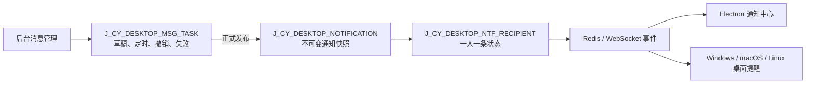
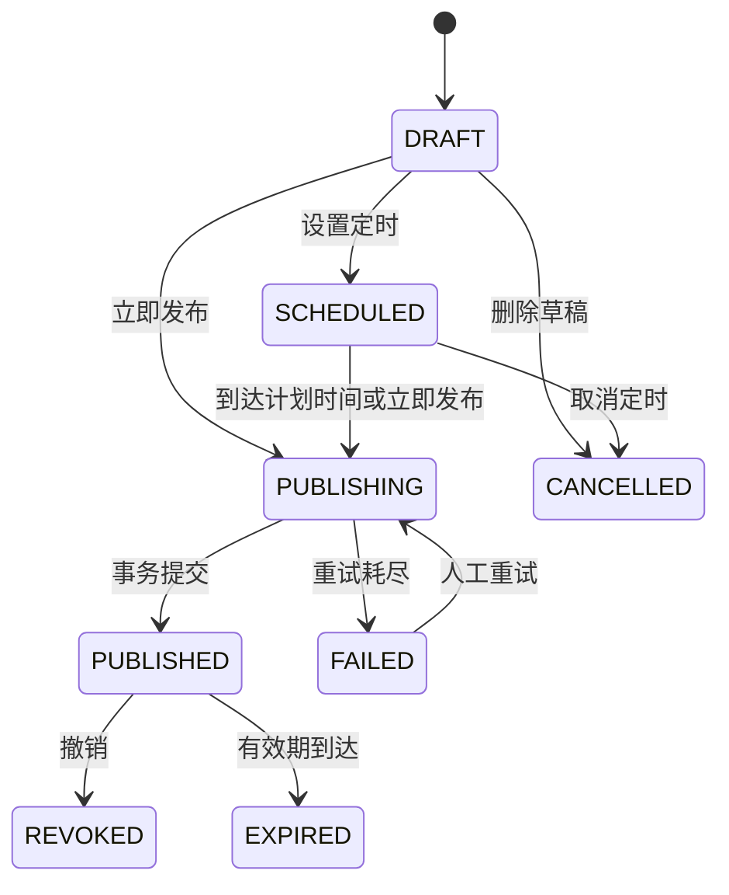

# 桌面消息管理与全员推送设计

- 日期：2026-07-22
- 状态：方案已确认，待书面规格审阅
- 后台项目：`E:/ZZY_PROJECT/lianshang_liaoning/SjBang_BackStageV1.0`
- 服务项目：`E:/ZZY_PROJECT/lianshang_liaoning/cloud-service/cloud-api`
- Electron 项目：`E:/ZZY_PROJECT/AI_lianliao/AionUi`
- 前置规格：`docs/superpowers/specs/2026-07-21-desktop-version-and-business-notification-design.md`

## 1. 背景与目标

现有桌面通知后台只有通知类型筛选、投递摘要列表和独立投递明细页。它可以审计已经生成的版本更新、供需对接、在建项目、企业码、会员积分和客服通知，但不能创建草稿、立即推送、定时推送、撤销人工消息，也不能按用户、企业、OpenID 和投递状态分页排查问题。

本次把现有“桌面通知审计”升级为“桌面消息中心”，目标如下：

1. 在既有 JSP 后台集中管理人工系统公告、业务自动通知和逐用户投递记录。
2. 支持草稿、立即全员推送、定时全员推送、取消、撤销、复制和失败重试。
3. 人工消息与已经发布的通知快照分层存储，避免草稿污染不可变审计记录。
4. 保留一条消息对应多条接收记录的模型，每个 Electron 登录账号独立维护待送达、已送达、桌面提醒、失败和已读状态。
5. 发布后通过现有 Redis/WebSocket 链路触达 Electron；离线用户下次登录仍能从通知中心拉取。
6. 第一版只支持标题和纯文本正文，同时为富文本、图片与附件保留协议和数据库扩展位置。
7. 后台页面继续使用 `CLOUD_URL + cloud-api/...` 直接请求 Cloud API。

## 2. 已确认的产品决策

| 决策项 | 已确认规则 |
| --- | --- |
| 管理方案 | 新增消息任务表，保留现有通知快照与接收人表 |
| 接收范围 | 全部有效 Electron 登录账号，不做企业或用户分组精准推送 |
| 发布能力 | 草稿、立即推送、定时推送、取消、撤销、失败重试 |
| 点击行为 | 通用消息只打开 Electron 通知详情，不跳业务模块或任意网页 |
| 内容格式 | 第一版为标题加多行纯文本；预留富文本、图片和附件扩展字段 |
| 撤销语义 | 取消尚未送达的接收记录；已弹出或已送达内容无法强制收回，审计记录永久保留 |
| 管理接口认证 | 按用户决定，不使用签名或 Token；后台浏览器直接请求 Cloud API |
| 前端技术 | 复用现有 Vue 2、Element UI、Axios 和 `CLOUD_URL` 约定 |
| 时间标准 | 所有计划时间、展示时间和调度判断使用 `Asia/Shanghai` |

不使用服务端认证意味着任何能够访问管理接口的调用方都可能创建全员消息。该风险是已知且被明确接受的产品约束。本次不暗中加入 Token、签名、后台会话代理或角色校验；仍必须实施严格参数校验、状态机校验、服务端去重和发布二次确认。

## 3. 范围与边界

### 3.1 本次包含

- 新增人工桌面消息任务表、序列、索引和 Oracle 约束。
- 扩展通知类型、点击动作、内容扩展信息和接收状态。
- 新增人工消息管理服务、管理接口和定时调度器。
- 扩展通知审计汇总、服务端分页、接收人身份摘要和失败重试接口。
- 把后台页面改造成“消息管理 / 推送记录 / 投递明细”三部分。
- Electron 支持通用系统公告详情、失败上报和撤销后的接收过滤。
- TDD、Mapper 契约测试、JSP 静态验证和 Electron 协议回归。

### 3.2 本次不包含

- 不做按企业、地区、会员等级、标签或账号名单选择受众。
- 不做短信、微信、邮件、浏览器 Push 或 H5 通知渠道。
- 不开放任意外部链接和后台自定义 Electron 路由。
- 不在第一版实现富文本编辑器、图片上传、附件下载和内容审核。
- 不删除已经发布的通知事实和投递审计记录。
- 不把版本发布、供需、项目和客服等现有业务通知改造成后台草稿。
- 不重构与消息中心无关的企业库、产品库、在建项目和客服业务。

## 4. 当前能力与缺口

当前数据库已经存在：

- `J_CY_DESKTOP_NOTIFICATION`：一条正式通知事实。
- `J_CY_DESKTOP_NTF_RECIPIENT`：一条通知对应多个接收人状态。

当前服务已经具备：

- 通过去重键创建不可重复的通知。
- 发布时从 `LS_PUBLIC_USER` 快照全部有效 OpenID。
- 事务提交后通过 Redis/WebSocket 广播通知 ID。
- Electron 查询列表、未读数量、标记已读、送达回执和桌面提醒回执。
- 管理端查询通知摘要和完整接收记录。

当前缺口包括：

- 草稿和定时任务没有独立数据载体。
- 没有通用系统公告类型和通知详情点击动作。
- 管理端只有游标“加载更多”，没有标准分页和组合筛选。
- 接收明细接口一次返回全部数据，不能支撑大量用户。
- 接收明细没有用户名、企业名称和 OpenID 搜索能力。
- `FAILED` 状态存在于枚举和表约束，但没有客户端失败上报路径。
- 管理端没有发布、撤销、取消、复制和重试操作。

## 5. 总体方案

采用“消息任务、通知快照、接收人投递”三层模型：



人工消息只在正式发布时进入通知快照表。版本、供需、在建项目和客服等现有业务仍直接创建通知快照，不经过人工消息任务表。

后台页面统一展示两类来源：

- 人工发布：`SOURCE_TYPE = J_CY_DESKTOP_MSG_TASK`。
- 业务自动：保留现有 `SOURCE_TYPE`，例如版本、供需和项目表。

## 6. Oracle 数据模型

### 6.1 新表 `J_CY_DESKTOP_MSG_TASK`

表名和所有约束名必须满足当前 Oracle 30 字节标识符限制。

| 字段 | 建议类型 | 规则 |
| --- | --- | --- |
| `ID` | `NUMBER(19,0)` | 主键，使用独立序列 |
| `TITLE` | `VARCHAR2(300 CHAR)` | 必填，第一版页面限制 100 个字符 |
| `CONTENT` | `VARCHAR2(2000 CHAR)` | 第一版纯文本正文 |
| `CONTENT_TYPE` | `VARCHAR2(24 CHAR)` | 第一版固定 `TEXT` |
| `EXTENSION_JSON` | `CLOB` | 预留富文本、图片、附件元数据；第一版为空 |
| `PRIORITY` | `VARCHAR2(16 CHAR)` | `NORMAL/HIGH/URGENT` |
| `STATUS` | `VARCHAR2(16 CHAR)` | 任务状态机 |
| `SCHEDULED_AT` | `TIMESTAMP(6)` | 定时发布时间 |
| `EXPIRES_AT` | `TIMESTAMP(6)` | 通知有效期，可空 |
| `PUBLISHED_AT` | `TIMESTAMP(6)` | 实际发布成功时间 |
| `REVOKED_AT` | `TIMESTAMP(6)` | 撤销时间 |
| `NOTIFICATION_ID` | `NUMBER(19,0)` | 发布后关联通知快照，可空 |
| `CREATED_BY` | `VARCHAR2(128 CHAR)` | 页面传入的操作人显示名，只用于审计展示，不构成身份认证 |
| `UPDATED_BY` | `VARCHAR2(128 CHAR)` | 最近操作人显示名 |
| `FAILURE_REASON` | `VARCHAR2(1000 CHAR)` | 最近一次发布失败摘要，不存堆栈和敏感数据 |
| `RETRY_COUNT` | `NUMBER(10,0)` | 调度发布自动重试次数 |
| `NEXT_RETRY_AT` | `TIMESTAMP(6)` | 下一次自动重试时间 |
| `VERSION_NO` | `NUMBER(10,0)` | 乐观锁，防止旧页面覆盖新状态 |
| `CREATE_TIME` | `TIMESTAMP(6)` | 创建时间 |
| `UPDATE_TIME` | `TIMESTAMP(6)` | 更新时间 |

需要创建：

- 序列 `SEQ_J_CY_DESKTOP_MSG_TASK`。
- 主键约束。
- 状态、优先级、内容类型和非负重试次数检查约束。
- `STATUS, SCHEDULED_AT, NEXT_RETRY_AT` 调度索引。
- `CREATE_TIME` 管理列表索引。
- `NOTIFICATION_ID` 普通索引和外键；通知事实已经提交后不允许物理删除。

### 6.2 任务状态

`STATUS` 允许：

- `DRAFT`：草稿。
- `SCHEDULED`：等待计划时间。
- `PUBLISHING`：实例已抢占，正在事务发布。
- `PUBLISHED`：通知快照和接收人快照均已提交。
- `CANCELLED`：草稿软删除或定时任务取消。
- `FAILED`：自动重试耗尽或人工立即发布失败。
- `REVOKED`：已发布后撤销。
- `EXPIRED`：有效期已到。

### 6.3 扩展现有通知表

`J_CY_DESKTOP_NOTIFICATION` 增加：

- `CONTENT_TYPE VARCHAR2(24 CHAR) DEFAULT 'TEXT' NOT NULL`。
- `EXTENSION_JSON CLOB`。

枚举和检查约束增加：

- 类型 `SYSTEM_ANNOUNCEMENT`。
- 点击动作 `OPEN_NOTIFICATION_DETAIL`。

现有业务通知写入 `CONTENT_TYPE = TEXT`，`EXTENSION_JSON = NULL`。预留字段只建立稳定边界，不代表第一版已实现富文本和图文渲染。未来启用富文本或图文仍须单独增加内容安全、上传、白名单和 Electron 渲染测试；如果正文超过 2000 字符，还需要独立评审是否把快照正文迁移为 CLOB。

通知审计列表不额外增加可编辑状态字段。人工通知的管理状态从关联的消息任务读取，业务自动通知默认视为已发布；过期状态由 `EXPIRES_AT` 计算。这样不会把草稿状态混入不可变通知事实。

### 6.4 扩展接收人状态

`J_CY_DESKTOP_NTF_RECIPIENT.DELIVERY_STATUS` 增加 `CANCELLED`。

状态语义：

- `PENDING`：离线或尚未提交结果，不视为失败。
- `DELIVERED`：Electron 已确认收到通知。
- `FAILED`：Electron 明确上报处理失败。
- `CANCELLED`：发布者撤销时仍未成功送达，之后不再返回给该用户。

`ATTEMPT_COUNT` 记录客户端投递结果上报次数。送达回执或失败回执各增加一次；单纯离线不会增加次数，也不会进入失败状态。

## 7. 状态流转与操作规则



规则如下：

1. 只有 `DRAFT` 和 `SCHEDULED` 可以编辑标题、正文、优先级和时间。
2. `PUBLISHED` 内容不可编辑，只能查看、撤销或复制为新草稿。
3. “删除草稿”实际写为 `CANCELLED`，不物理删除。
4. 定时时间必须晚于服务端当前时间；有效期存在时必须晚于定时时间或实际发布时间。
5. 发布使用固定去重键 `MANUAL_MESSAGE:{TASK_ID}`。
6. 重复请求、重复定时扫描或服务重启不能生成第二条通知快照。
7. 复制由后台读取原任务后创建新草稿，新任务拥有新 ID 和新去重键。

## 8. Cloud API 组件边界

### 8.1 人工消息组件

新增独立包，避免把人工任务状态机塞入现有通知投递服务：

- `DesktopMessageTask`：任务实体。
- `DesktopMessageTaskCommand`：创建、编辑、定时和发布输入。
- `DesktopMessageTaskMapper`：任务 CRUD、分页和原子状态迁移。
- `DesktopMessageTaskService`：业务规则、状态机、发布协调和撤销。
- `DesktopMessageScheduler`：扫描、抢占、自动重试和停滞恢复。
- `DesktopMessageAdminController`：后台直接调用的管理接口。

现有 `DesktopNotificationService` 继续负责：

- 创建不可变通知快照。
- 创建全员或指定接收人快照。
- 去重。
- 事务提交后发布实时事件。
- Electron 列表、回执和已读状态。

人工任务服务通过现有通知服务发布 `SYSTEM_ANNOUNCEMENT`，不复制通知写入逻辑。

### 8.2 管理接口

`DesktopMessageAdminController`：

| POST 路径 | 输入摘要 | 行为 |
| --- | --- | --- |
| `page` | 页码、页数、关键字、状态、优先级、时间范围 | 查询人工消息任务 |
| `detail` | `messageId` | 查询完整任务和关联通知摘要 |
| `saveDraft` | 可选 ID、版本号、内容、优先级、有效期、操作人 | 新建或修改草稿 |
| `schedule` | ID、版本号、计划时间、有效期 | 保存并进入 `SCHEDULED` |
| `publishNow` | ID、版本号 | 抢占并立即全员发布 |
| `cancel` | ID、版本号 | 取消草稿或定时任务 |
| `revoke` | ID、版本号 | 撤销已发布任务并取消未送达接收人 |
| `retry` | ID、版本号 | 重新执行失败任务 |
| `recipientCount` | 无业务输入 | 返回当前有效 OpenID 数量，仅供发布前预计 |

`DesktopNotificationAdminController` 扩展：

| POST 路径 | 输入摘要 | 行为 |
| --- | --- | --- |
| `summary` | 与通知列表相同的筛选 | 返回接收、送达、桌面提醒、已读、失败和取消统计 |
| `list` | 页码、页数、标题、来源、类型、状态、时间范围 | 分页查询人工和业务自动通知 |
| `recipientPage` | 通知 ID、用户关键字、投递/阅读状态、时间、分页 | 查询逐用户投递明细 |
| `retryFailedRecipients` | 通知 ID | 仅把失败记录恢复为待送达并重新发布通知事件 |

现有 `recipientList` 在兼容期保留，但新后台不再一次性加载全部接收人。

### 8.3 直接 Ajax 约定

后台继续直接调用：

```javascript
axios.post(
  CLOUD_URL + 'cloud-api/DesktopMessageAdminController/publishNow',
  payload
)
```

接口不要求 Token、签名或后台代理。Cloud API 必须自行执行：

- POST JSON 类型和空值校验。
- 标题、正文、操作人、失败原因和扩展字段长度限制。
- 枚举白名单。
- 非零有符号整数 ID 字符串解析。
- 状态迁移和乐观锁校验。
- 服务端生成去重键，浏览器不能自定义。
- 中文、稳定、可展示的业务错误；响应不得包含 SQL、堆栈和数据库连接信息。

## 9. 发布事务与定时调度

### 9.1 立即发布

1. 后台完成表单校验，查询预计接收人数并显示二次确认。
2. `publishNow` 使用 `ID + VERSION_NO + 当前状态` 原子更新为 `PUBLISHING`。
3. 服务端检查 `DESKTOP_NOTIFICATION_ENABLED=true`；关闭时拒绝发布，但仍允许保存和编辑草稿。
4. 服务端构造固定的 `SYSTEM_ANNOUNCEMENT` 命令：
   - `ACTION_TYPE = OPEN_NOTIFICATION_DETAIL`
   - `SOURCE_TYPE = J_CY_DESKTOP_MSG_TASK`
   - `SOURCE_ID = TASK_ID`
   - `DEDUP_KEY = MANUAL_MESSAGE:{TASK_ID}`
5. 现有通知服务写入通知快照并从 `LS_PUBLIC_USER` 快照全部 `DEL_SIGN = N` 且 OpenID 非空的接收人。
6. 同一事务把任务更新为 `PUBLISHED`，写入通知 ID 和实际发布时间。
7. 事务提交后发布 Redis/WebSocket 事件。

通知写入失败时，整个发布事务回滚，不能出现“任务已发布但没有通知”或“通知已存在但任务仍是草稿”的半状态。失败状态记录使用独立恢复事务写入安全错误摘要。

### 9.2 定时发布

- 使用现有 Spring `@EnableScheduling`，新增独立调度器。
- 默认每 30 秒扫描 `SCHEDULED_AT <= SYSTIMESTAMP` 或 `NEXT_RETRY_AT <= SYSTIMESTAMP` 的有限批次。
- 每个候选任务通过条件更新抢占：只有预期状态和版本号仍匹配的实例能写入 `PUBLISHING`。
- 多实例部署时，未抢占成功的实例跳过该任务。
- 抢占成功后复用立即发布事务，不维护第二套写入代码。

### 9.3 自动重试与停滞恢复

- 调度发布的数据库失败按 1、5、15 分钟最多自动重试三次。
- 第一次和第二次失败后回到 `SCHEDULED`，写入 `NEXT_RETRY_AT`、安全错误摘要和累计次数；只有重试耗尽才进入 `FAILED`。
- 三次耗尽后进入 `FAILED`，后台展示安全错误摘要和人工重试按钮。
- 人工立即发布第一次失败即可进入 `FAILED`，避免浏览器请求等待后台重试。
- 服务启动后和周期扫描时，把超过 10 分钟仍为 `PUBLISHING` 且没有通知关联的任务恢复为待重试。
- 如果去重键已经存在通知快照，恢复逻辑关联该通知并把任务修复为 `PUBLISHED`，不再次广播新事实。
- WebSocket 发布发生在数据库提交后；实时发布失败只记日志，不把已经提交的消息标记为发布失败。离线或未实时收到的客户端仍可从列表接口拉取。

## 10. 撤销、失败上报与重试

### 10.1 撤销

撤销只允许人工消息任务执行：

1. 任务从 `PUBLISHED` 原子更新为 `REVOKED`。
2. 对关联通知下仍为 `PENDING` 或 `FAILED`，并且没有桌面提醒和阅读时间的接收记录更新为 `CANCELLED`。
3. `DELIVERED` 或已经有提醒/阅读时间的记录保留原状。
4. Electron 列表接口不返回 `CANCELLED` 接收记录。
5. 已经弹出的系统通知和已经缓存到客户端的内容不能保证收回，后台提示必须明确这一限制。

### 10.2 Electron 失败上报

新增固定客户端接口 `deliveryFailed`，输入仅包括通知 ID、当前登录 OpenID 和受控错误码。服务端把受控错误码转换为固定中文摘要，不接收任意异常堆栈。

只有客户端明确上报内容类型不受支持、内容格式无效或通知详情无法展示时才进入 `FAILED`。用户离线、WebSocket 未连接和暂未回执均保持 `PENDING`。操作系统提醒未弹出不等于消息投递失败：消息已经进入通知中心时继续保持 `DELIVERED`，只是不写 `DESKTOP_NOTIFIED_AT`。

### 10.3 失败接收人重试

`retryFailedRecipients`：

1. 只更新目标通知下的 `FAILED` 记录为 `PENDING`。
2. 清理旧失败原因，保留历史上报次数。
3. 重新发布相同通知 ID 的实时事件。
4. 不创建新的通知快照和接收人记录，避免用户出现重复消息。
5. 关联人工任务已经撤销或过期时拒绝重试。

## 11. 后台页面设计

### 11.1 文件拆分

后台继续使用无构建的 Vue 2 与 Element UI：

```text
WebRoot/backstage/desktop_notification/
├── desktop_notification_list.jsp
├── desktop_notification_detail.jsp
├── css/
│   └── desktop_notification_center.css
└── js/
    ├── desktop_notification_api.js
    └── desktop_notification_center.js
```

- JSP 只负责后台壳、页面容器、脚本和样式引用。
- API 文件封装 `CLOUD_URL`、响应解析和统一错误转换。
- Center 文件管理 Vue 状态、筛选、分页、表单、抽屉和确认流程。
- CSS 文件承载统计卡片、表格、发布表单、预览和响应式布局。
- 原投递详情 JSP 保留兼容；旧链接访问后跳回消息中心，并通过查询参数自动打开对应投递抽屉。

### 11.2 页面结构

页面标题改为“桌面消息中心”，右上角提供“发布消息”。

顶部概览卡片：

- 待定时发布。
- 今日已推送。
- 今日送达率。
- 发送失败。

三个标签：

1. **消息管理**：只展示人工任务，支持草稿、定时、发布、取消、撤销、复制和失败重试。
2. **推送记录**：统一展示人工与业务自动通知的接收、送达、提醒、阅读和失败统计。
3. **投递明细**：按选中通知或全局条件分页排查具体接收人。

### 11.3 发布表单

字段包括：

- 标题，页面限制 100 个字符，数据库上限 300。
- 多行纯文本正文，上限 2000 个字符。
- 优先级：普通、重要、紧急。
- 有效期：7 天、30 天、自定义或长期有效。
- 发布方式：立即、定时、仅保存草稿。
- 预计接收人数：全部有效 Electron 登录账号。
- Electron 展示预览。

立即发布前二次确认。定时消息执行前允许编辑、立即发布或取消。已发布内容不允许编辑。

### 11.4 列表与分页

- “加载更多”改为 Element UI 标准分页。
- Oracle 11g 使用 `ROW_NUMBER()` 实现页码和页数查询。
- 消息任务、通知审计和接收明细支持每页 20、50、100 条。
- 翻页后自动滚动到对应表格表头。
- 筛选变化后回到第一页。
- 所有异步按钮使用 Loading 并禁止重复提交。

消息任务筛选：标题、状态、优先级、计划/发布时间。

通知筛选：标题、人工/业务来源、通知类型、发布状态和时间范围。

投递筛选：用户名、企业名称、OpenID、投递状态、阅读状态和时间范围。

接收身份摘要通过 OpenID 左连接 `LS_PUBLIC_USER` 获取用户名，并通过现有用户企业关系获取当前有效企业名称。找不到关联时仍展示 OpenID 和投递状态，不能丢失审计行。页面默认缩略展示 OpenID，搜索和详情仍可使用完整值。

## 12. Electron 行为

Electron 增加 `SYSTEM_ANNOUNCEMENT` 和 `OPEN_NOTIFICATION_DETAIL` 协议映射：

- 通知中心显示标题、优先级、创建时间和纯文本摘要。
- 点击列表或原生系统提醒后进入现有通知中心详情视图。
- 详情按纯文本渲染并保留换行，不使用 `innerHTML`。
- 第一版忽略空的扩展 JSON；未知内容类型显示安全的“不支持此消息格式”提示并上报固定失败码。
- Windows、macOS 和 Linux 原生提醒复用现有桌面通知能力。
- 成功接收、成功调用系统通知、打开详情和处理失败分别上报既有或新增状态接口。
- 操作系统通知被用户关闭或平台调用失败时不写桌面提醒时间，也不把已经送达通知改为失败。
- 拉取列表时过滤过期通知和 `CANCELLED` 接收记录。
- 用户已允许当前企业会话明文传输 OpenID；消息接口仍只操作当前登录 OpenID，不允许 Renderer 为其他用户上报状态。

## 13. 统计口径

| 指标 | 口径 |
| --- | --- |
| 接收总数 | 关联通知的全部接收人快照，不含撤销后取消数量时须同时单列取消数 |
| 待送达 | `DELIVERY_STATUS = PENDING` |
| 已送达 | `DELIVERY_STATUS = DELIVERED` |
| 桌面提醒 | `DESKTOP_NOTIFIED_AT IS NOT NULL` |
| 已读 | `READ_AT IS NOT NULL` |
| 未读 | 未取消且 `READ_AT IS NULL` |
| 失败 | `DELIVERY_STATUS = FAILED` |
| 已取消 | `DELIVERY_STATUS = CANCELLED` |
| 送达率 | 已送达 /（接收总数 - 已取消），分母为零时显示 `-` |
| 阅读率 | 已读 /（接收总数 - 已取消），分母为零时显示 `-` |

后台汇总 SQL 使用一次分组聚合或聚合子查询，不为每个列表行执行多组相关子查询。接收明细必须服务端分页，不能先全量加载再由浏览器过滤。

## 14. 错误处理与并发

| 场景 | 行为 |
| --- | --- |
| 网络失败 | 保留表单和筛选条件，显示重试，不显示成功状态 |
| 旧页面提交 | 乐观锁失败，提示“消息状态已更新”并刷新详情 |
| 重复点击发布 | 只有一次状态抢占成功；重复请求返回已有结果 |
| 定时时间已过 | 服务端拒绝保存，提示重新选择时间 |
| 有效期早于发布时间 | 前后端都拒绝 |
| 发布事务失败 | 不产生半状态，安全摘要写入失败任务 |
| WebSocket 事件失败 | 数据保持已发布；记录日志，客户端后续拉取 |
| 用户离线 | 保持待送达，不计为失败 |
| Electron 明确失败 | 写入失败状态、上报次数和受控原因 |
| 撤销并发遇到送达回执 | 条件更新保证已送达优先保留；只取消仍为待送达的记录 |
| 返回数据不合法 | 页面拒绝使用并显示统一查询失败，不拼接服务器异常正文 |

## 15. 测试策略

所有新行为遵循 TDD：先编写会因能力缺失而失败的测试，确认失败原因，再实现最小代码并运行相关回归。

### 15.1 数据库与 Mapper

- DDL 契约验证表、字段、序列、索引、唯一性、检查约束和 30 字节名称限制。
- 现有通知类型、动作和接收状态约束正确扩展。
- 管理列表和接收明细的 `ROW_NUMBER()` 分页边界正确。
- 标题、来源、状态、用户、企业、OpenID 和时间组合筛选正确。
- 身份关联缺失时投递记录仍然返回。
- 汇总统计的取消、送达、桌面提醒、已读和失败口径正确。

### 15.2 任务服务与调度器

- 创建和修改草稿只允许合法状态。
- 定时、立即发布、取消、撤销、过期和失败状态流转。
- 旧版本号不能覆盖新任务状态。
- 多实例同时抢占同一任务时只成功一次。
- 相同任务的重复请求只生成一个通知快照。
- 通知、接收人和任务发布结果保持事务一致。
- 1、5、15 分钟重试计算和三次耗尽逻辑。
- 停滞 `PUBLISHING` 的恢复和已有去重通知的关联修复。
- 撤销取消未成功送达且没有提醒/阅读记录的待送达或失败接收人。
- 重试失败接收人不创建重复通知和重复接收行。

### 15.3 管理接口

- 所有管理端点可由直接浏览器 Ajax 调用，不要求 Token 或内部请求头。
- 空请求、非法 ID、非法枚举、超长内容和错误时间返回稳定中文业务错误。
- 浏览器不能自定义去重键、来源表和接收人名单。
- 页码、页数和最大 100 条限制正确。
- 发布、撤销和重试接口在状态冲突时返回可刷新提示。

### 15.4 JSP 与交互

- 所有请求使用 `CLOUD_URL + 'cloud-api/...'`。
- 三个标签、概览卡片和状态操作矩阵正确。
- 发布表单、字符计数、时间依赖和二次确认正确。
- 分页后滚动到对应表头；筛选后回到第一页。
- 发布期间按钮禁用，网络失败保留表单。
- 投递抽屉展示统计、用户摘要、OpenID、各时间和失败原因。
- 旧详情链接能定位到新抽屉。
- JSP、JS 和 CSS 中文以 UTF-8 保存，防止标题再次乱码。

### 15.5 Electron

- `SYSTEM_ANNOUNCEMENT` 契约解析和未知内容类型降级。
- 点击系统公告进入通知详情，不跳外部 URL。
- 纯文本换行安全渲染，不执行 HTML。
- 送达、桌面提醒、已读和固定失败码上报。
- 撤销后待送达用户不再拉取；已送达审计不被删除。
- Windows、macOS 和 Linux 原生提醒回归。

## 16. 数据库迁移与发布顺序

数据库修改必须先提交审阅脚本，并在获得明确数据库修改确认后执行。建议顺序：

1. 执行新增任务表、序列和索引脚本。
2. 扩展通知表字段及类型、动作约束。
3. 扩展接收状态约束。
4. 运行只读结构验证工具确认所有对象存在且约束有效。
5. 部署兼容新旧数据的 Cloud API；新增字段对历史通知使用默认 `TEXT`。
6. 部署后台消息中心。
7. 部署识别系统公告和失败上报的 Electron 版本。
8. 最后设置 `DESKTOP_NOTIFICATION_ENABLED=true` 并执行受控测试消息。

发布前至少验证：

- Cloud API 旧 Electron 列表接口仍能读取历史通知。
- 新 Electron 能读取历史类型和新系统公告。
- 后台直接跨域请求的环境配置与现有版本管理页面一致。
- Redis/WebSocket 不可用时，通知仍可通过下次登录拉取。

## 17. 验收标准

1. 后台页面名称为“桌面消息中心”，可以在同一模块管理人工消息、查看全部推送记录和逐用户投递明细。
2. 管理员能保存草稿、立即推送、定时推送、取消、撤销、复制和重试失败任务。
3. 人工消息发布时只生成一个不可变通知快照，并为全部有效 OpenID 创建一人一条接收记录。
4. 多次点击、定时扫描并发或服务重启不会产生重复消息。
5. 定时任务按上海时区执行，失败按 1、5、15 分钟重试，耗尽后可人工重试。
6. 撤销只取消未送达接收人；已送达、已提醒、已读及失败记录保留审计。
7. 离线用户显示待送达而不是失败；客户端明确失败才进入失败状态。
8. 消息、通知和接收明细均使用服务端分页，翻页自动回到表头。
9. Electron 在通知中心和三个桌面平台显示系统公告，点击只打开纯文本通知详情。
10. 第一版不实现富文本和图文，但数据库、API 和 Electron 协议包含明确的内容类型与扩展字段边界。
11. 管理接口按已确认规则不要求 Token 或签名，并继续由后台使用 `CLOUD_URL` 直接请求。
12. 所有数据库、服务、JSP 和 Electron 自动化验证通过后，才允许发布测试消息。

## 18. 后续扩展

富文本与图文不是第一版验收内容。后续启用时应单独设计：

- 富文本白名单、清洗和跨平台一致渲染。
- 图片上传、文件类型、大小、HTTPS 域名和生命周期。
- 附件病毒扫描、下载权限、失效和审计。
- 内容模板、预览和版本化。
- 如果内容规模超过现有限制，评审正文 CLOB 或独立内容表。
- 如果未来需要精准推送，新增受众规则和受众快照，不能修改已经发布消息的接收人集合。

这些扩展继续复用消息任务到通知快照的发布边界，不改变历史通知和接收人记录。

## 19. 实施记录（2026-07-22）

### 19.1 已实现范围

- Cloud API 已实现人工消息任务、状态机、立即发布、定时调度、失败恢复、撤销、逐接收人审计及管理接口。
- 后台 `desktop_notification` 模块已升级为消息管理、推送记录和投递明细三部分，所有 Ajax 请求继续使用 `CLOUD_URL + cloud-api/...`。
- Electron 已实现系统公告协议、未知内容类型失败上报、送达与桌面提醒回执、受控详情跳转和多行纯文本详情。
- 新增 `E:/ZZY_PROJECT/AI_lianliao/tools/verify_desktop_message_schema.py`，仅固定查询 `USER_TABLES`、`USER_TAB_COLUMNS`、`USER_INDEXES`、`USER_CONSTRAINTS` 和 `USER_SEQUENCES`；事务以 `SET TRANSACTION READ ONLY` 开始并始终回滚。

### 19.2 自动化验证结果

- Cloud API 目标回归：58 项通过，0 failures，0 errors。
- 后台脚本：两份 JavaScript 语法检查及 Cloud API 直连契约检查通过。
- Python 只读工具：新工具 4 项、既有 Oracle 只读工具 7 项，共 11 项通过。
- Electron：桌面通知目标测试 19 项通过；企业测试 TypeScript 检查通过；`npm run package` 的主进程、预加载和 Renderer 构建通过。
- Electron 全仓 `tsc --noEmit` 仍有两处既有 `desktopVersionDownloader.ts` TS7011，与本次消息中心实现无关；目标企业类型检查与实际打包均已通过。

### 19.3 数据库与真实联调状态

- 增量迁移尚未执行；本轮没有执行 DDL、DML，也没有发布测试消息。
- 迁移脚本：`E:/ZZY_PROJECT/lianshang_liaoning/cloud-service/cloud-api/src/main/resources/db/desktop_message_management_migration.sql`。
- 对 `cloud-api/src/main/resources/application.yml` 默认 Oracle 数据源执行固定只读检查后，结果为 `migrationComplete: false`。
- 当前缺少 `J_CY_DESKTOP_MSG_TASK`、`SEQ_J_CY_DESKTOP_MSG_TASK`、三项任务索引和任务表相关约束；`J_CY_DESKTOP_NOTIFICATION` 还缺少 `CONTENT_TYPE`、`EXTENSION_JSON` 与 `CK_J_CY_DN_CONTENT`。
- 因数据库迁移尚未获得本轮明确执行确认，真实发布、定时任务、撤销、WebSocket 和 Electron 端到端联调均记录为“未执行”，不能视为通过。
