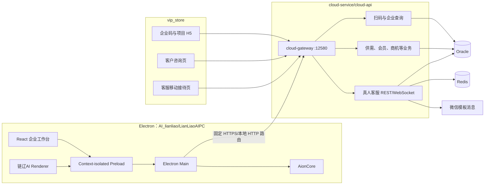
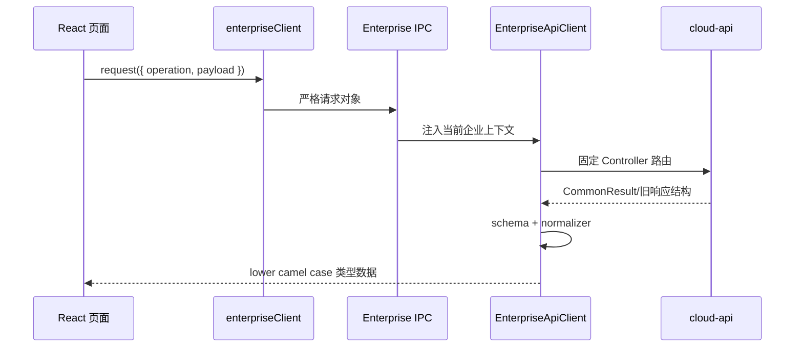

# 系统架构与数据流

## 1. 总体架构



## 2. Electron 安全分层

### 2.1 Renderer

Renderer 只负责 React 展示、交互和页面状态：

- 不能读取文件系统或 Node API；
- 不能自行拼接后端 URL；
- 既有企业展示上下文允许包含明文 `openId`，但新增特权请求不能接受 Renderer 自选身份；
- 不能读取或传递客服访问令牌和 WebSocket 票据；
- 不能用隐藏字段覆盖主进程注入身份；
- 所有来自 IPC 的数据再次执行 Zod 校验。

### 2.2 Preload

Preload 使用 `contextBridge` 暴露窄接口：

- 每个业务动作具有固定方法和 IPC channel；
- 调用前校验输入，返回后校验统一结果 envelope；
- 不暴露通用 `ipcRenderer.invoke`；
- 不暴露任意 URL、令牌、文件路径或主进程异常对象。

### 2.3 Main

主进程负责：

- 从企业会话存储读取当前 `openId`，覆盖 Renderer 对特权操作提交的身份；
- 根据 `app.isPackaged` 选择固定本地或生产 API；
- 把 Renderer 业务命令序列化为允许列表请求；
- 校验响应、执行超时、网络错误归类和敏感信息脱敏；
- 管理客服短期令牌、WebSocket、通知、托盘和窗口聚焦；
- 启动并管理 AionCore、更新服务和本地资源。

## 3. 企业查询数据流



当前允许列表只包括企业、产品和项目读取操作。收藏、商机写入、项目解锁、供需、会员和发布不能绕过允许列表直接调用旧 Controller；它们需要新增明确契约。

## 4. 扫码登录数据流

1. Electron 主进程调用 `/CommonWxGZHQrCodeLogIn/desktop/create` 创建 300 秒扫码会话；
2. Renderer 展示服务端返回的二维码；
3. 主进程按服务端建议间隔调用 `/desktop/poll`；
4. 状态为 `WAITING` 时继续轮询；
5. 状态为 `REGISTER_REQUIRED` 时展示固定手机注册链接二维码；
6. 状态为 `AUTHENTICATED` 时保存 `openId`，再调用 `/DesktopEnterpriseController/userContext`；
7. 应用重启只从受控会话文件恢复 `openId`，重新查询用户上下文；
8. 退出登录清除会话并通知客服 Gateway 断开。

## 5. 真人客服架构

当前真人客服已经从早期“HTTP 轮询”方案升级为：

```text
cloud-api + Oracle + Redis + Spring TextWebSocketHandler + 自定义 JSON 协议
```

客户端：

- H5 客户：`/customer-service/chat`；
- H5 客服：`/customer-service/reception`；
- Electron 客服：`/enterprise/customer-service`；
- Electron 普通用户：`/enterprise/consultation`，使用独立客户 Gateway、IPC、Socket、未读和通知状态。

服务端核心流程：

1. 客户或客服用 `openId` 调 REST 认证换取短期访问令牌；
2. 访问令牌换取 60 秒一次性 WebSocket ticket；
3. 客户打开或恢复唯一未结束会话；
4. 新会话复用 `YlsbUser/getAllocationKeFuUserInfo` 的分配逻辑；
5. 消息先写 Oracle，事务成功后返回 `message.ack` 并广播；
6. Redis 保存短期令牌、ticket、在线状态、连接路由和跨实例广播；
7. 新分配和转接使用 `WEIXIN_TEMPLATE.ID=5` 推送给客服；
8. 客户与客服均可结束；24 小时无消息由任务自动结束。

Electron 客服和 Electron 客户必须使用独立 Gateway/IPC/Socket/令牌状态，只共享协议、Schema、API Client 原语和 SocketClient 类。

## 6. AionCore 与链辽AI

Electron 主进程启动 AionCore，并通过现有 IPC/HTTP 能力驱动链辽AI。Windows x64 开发资源位于：

```text
E:/ZZY_PROJECT/AI_lianliao/LianLiaoAIPC/resources/bundled-aioncore/win32-x64/aioncore.exe
```

开发解析优先级：

```text
AIONUI_BACKEND_BIN
→ process.resourcesPath 随包资源
→ app.getAppPath()/resources/bundled-aioncore/<runtime>
→ PATH
```

打包版禁止读取源码目录和开发覆盖。企业 AI 助手如需使用 AionCore，必须只传递经过白名单裁剪的企业上下文，并且写操作只生成待用户确认的结构化草稿。

## 7. 未来业务模块架构原则

收藏、供需、会员、发布、积分和支付都采用同一边界：

```text
React 页面
→ Renderer Client
→ 严格 Preload/IPC 命令
→ Main 固定 API Client
→ cloud-api 桌面聚合契约
→ 服务层事务/权限/幂等
→ Oracle 或外部可信服务
```

禁止 Renderer 直接适配多套旧 Controller 返回，也禁止把后端事务和权限规则复制到前端。
