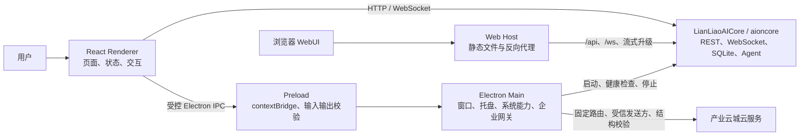
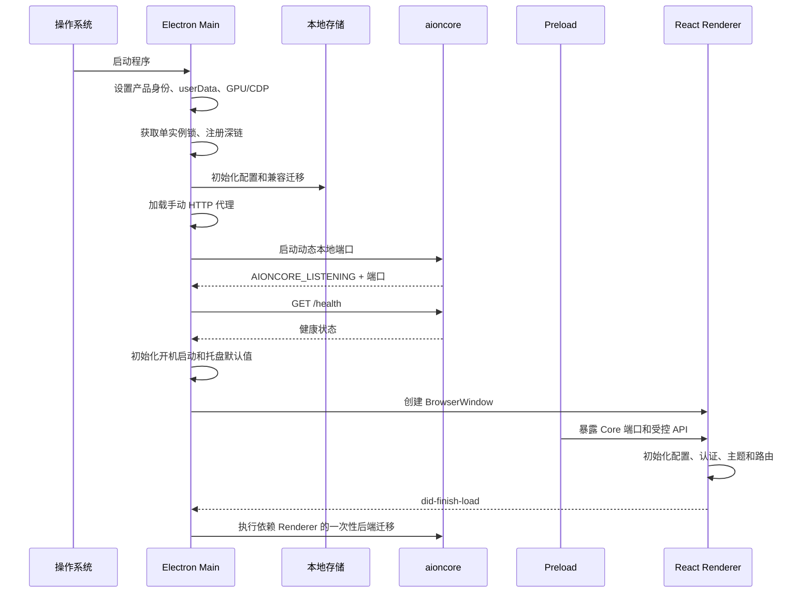
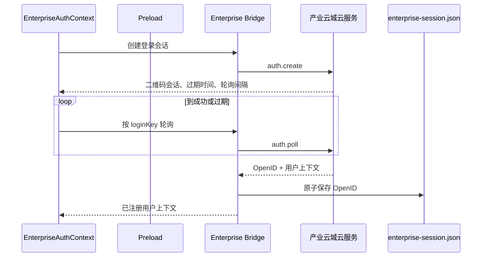
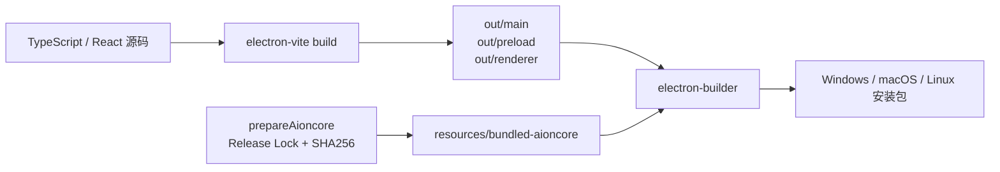

# LianLiaoAIPC 项目结构与代码逻辑说明书

> 适用项目：`E:\ZZY_PROJECT\AI_lianliao\LianLiaoAIPC`
> 产品名称：链上辽宁·产业云城 AI桌面平台
> AI 功能区简称：链辽AI
> 文档基线日期：2026-07-29
> 当前桌面版本：2.1.29
> 当前锁定 Core 版本：v0.1.48

## 1. 文档目的

本文档面向接手开发、日常维护、测试、构建和发布人员，说明 LianLiaoAIPC 的实际目录结构、运行方式、核心代码链路、数据边界和扩展方法。

文档以当前源码和配置为主要事实来源，优先级如下：

1. 当前源码和构建配置；
2. 当前自动化测试；
3. 仓库规则与现有设计文档；
4. 历史交接资料。

`LianLiaoAIPC/docs/ai-development-handoff` 中的资料可帮助理解历史背景，但其中部分目录描述已与当前源码不同。本文档对这类内容已按当前代码重新核对。

## 2. 项目定位

LianLiaoAIPC 是一个 Electron 桌面客户端，同时具备浏览器 WebUI 和独立 Web CLI 运行能力。它把两类业务组合在同一个桌面壳中：

- 产业云城工作台：企业登录、企业/产品/项目数据、供需发布、统一搜索、客户咨询、客服接待、通知和版本更新；
- 链辽AI：AI 助手、对话、模型供应商、ACP Agent、MCP 工具、技能、定时任务、文件工作区、文档预览和团队协作。

桌面前端并不独立完成 AI 任务执行。AI 对话、数据库、Agent、MCP、技能和大量文件能力由随安装包分发的 Rust Core——`aioncore.exe`（其他平台无 `.exe` 后缀）提供。

## 3. 总体架构



系统存在四条主要通信链路：

| 链路                               | 用途                                                         | 实现                                                              |
| ---------------------------------- | ------------------------------------------------------------ | ----------------------------------------------------------------- |
| Renderer → Core                    | AI、对话、配置、文件、模型、MCP、技能、定时任务等            | `httpBridge.ts` 通过动态本地端口访问 REST，WebSocket 接收实时事件 |
| Renderer → Preload → Main          | 窗口、托盘、系统设置、通知、文件对话框、WebUI 开关等桌面能力 | `@office-ai/platform` bridge 和 Electron IPC                      |
| Renderer → Preload → Main → 企业云 | 企业登录、企业业务、客服、通知、桌面版本                     | 固定 IPC 面、Zod 校验、受信发送方检查、固定云端路由               |
| 浏览器 → Web Host → Core           | 无 Electron 环境的 WebUI                                     | 同源 `/api/*` 反向代理和 `/ws` TCP 转发                           |

## 4. 仓库与工作区结构

### 4.1 仓库级结构

```text
AI_lianliao/
├─ LianLiaoAIPC/          Electron 桌面端、WebUI 和 Web CLI
├─ LianLiaoAICore/        Rust Core 源码
├─ docs/                  跨项目说明和本说明书
└─ .github/workflows/     Core 与桌面端的正式发布工作流
```

桌面端源码目录和 Core 源码目录是仓库级固定名称，不应重命名。

### 4.2 LianLiaoAIPC 顶层结构

```text
LianLiaoAIPC/
├─ packages/
│  ├─ desktop/            Electron 主程序
│  ├─ web-host/           WebUI 静态服务、反向代理和 Core 生命周期
│  ├─ web-cli/            独立 WebUI 命令行入口
│  └─ shared-scripts/     Core 下载、校验和准备逻辑
├─ resources/             图标、Hub 资源、打包后的 Core 资源
├─ public/                渲染端公共静态资源
├─ scripts/               构建、打包、Core 准备、调试脚本
├─ tests/                 单元、集成、端到端、基准测试
├─ docs/                  桌面项目内部文档
├─ examples/              示例
├─ mobile/                移动端相关辅助内容
├─ package.json           根包、脚本、版本和工作区定义
├─ aioncore-release-lock.json
├─ vitest.config.ts
├─ playwright.config.ts
└─ uno.config.ts
```

以下目录主要是依赖、构建、覆盖率或发布产物，不应作为源码结构依据：

- `node_modules/`
- `out/`
- `coverage/`
- `release-desktop*/`
- 测试生成的 `tests/e2e/results/`、`tests/e2e/report/`

### 4.3 Monorepo 包职责

| 包                       | 职责                                                            |
| ------------------------ | --------------------------------------------------------------- |
| `@aionui/desktop`        | Electron 主进程、preload、React renderer 和桌面资源             |
| `@aionui/web-host`       | 启动/停止 Core，提供静态站点，反向代理 REST 和 WebSocket        |
| `@aionui/web-cli`        | 在没有 Electron 桌面窗口时启动 WebUI，并提供重置密码等 CLI 能力 |
| `@aionui/shared-scripts` | 按 Release Lock 准备和验证多平台 Core                           |

当前源码规模快照如下。文件数量会随开发变化，仅用于判断模块体量：

| 区域                   | 文件数 | TypeScript/JavaScript 代码行约数 |
| ---------------------- | -----: | -------------------------------: |
| `desktop/src/renderer` |    916 |                           97,912 |
| `desktop/src/process`  |     87 |                           16,954 |
| `desktop/src/common`   |    115 |                           15,591 |
| `desktop/src/preload`  |      4 |                              656 |
| `web-host/src`         |      8 |                            2,661 |
| `web-cli/src`          |      3 |                              606 |
| `shared-scripts/src`   |      2 |                              769 |

Renderer 文件数包含多语言 JSON、样式和静态资源，不能直接等同于业务代码复杂度。

## 5. 技术栈

| 层次       | 主要技术                                                       |
| ---------- | -------------------------------------------------------------- |
| 桌面运行时 | Electron 37                                                    |
| 前端       | React 19、TypeScript 5.8、React Router                         |
| 构建       | electron-vite、Vite、electron-builder                          |
| UI         | Arco Design、Ant Design、UnoCSS                                |
| 状态与校验 | React Context、Zod                                             |
| 国际化     | i18next、react-i18next                                         |
| 图表与内容 | ECharts、Markdown、Mermaid、Monaco/CodeMirror、Office 预览组件 |
| 本地能力   | better-sqlite3、node-pty、WebSocket、Express                   |
| 测试       | Vitest、jsdom、Playwright                                      |
| 可观测性   | electron-log、Sentry、启动性能和基准脚本                       |
| 后端 Core  | Rust 编译的 `aioncore` 独立进程                                |

## 6. Desktop 源码分层

`packages/desktop/src` 是桌面端核心目录：

```text
src/
├─ index.ts               Electron 主入口
├─ sentry.ts              主进程 Sentry 和启动错误采集
├─ common/                跨进程共享类型、协议、配置和适配器
├─ preload/               暴露给 renderer 的受控 API
├─ process/               Electron 主进程业务
└─ renderer/              React 应用
```

### 6.1 `common`

`common` 必须保持跨环境可用，主要放置：

- `adapter/`：HTTP、IPC、浏览器和主进程桥接；
- `api/`：共享 API 定义；
- `chat/`：聊天协议、审批、文档、导航和斜杠命令类型；
- `config/`：配置服务、存储契约、国际化配置和常量；
- `enterprise/`：企业 IPC、客服、通知、版本、搜索等契约和 Schema；
- `networkProxy/`：代理配置契约；
- `platform/`：平台服务、产品标识、用户数据路径和迁移；
- `types/`：Agent、Channel、Office、Provider、Team 等类型；
- `update/`：更新模型。

共享层不应直接依赖 React 页面，也不应把 Electron 主进程对象泄漏到浏览器环境。

### 6.2 `process`

`process` 是 Electron Main 的实现区域：

| 目录         | 主要职责                                                               |
| ------------ | ---------------------------------------------------------------------- |
| `backend/`   | 定位打包或开发环境中的 `aioncore`                                      |
| `bridge/`    | 注册主进程 IPC Provider，包括应用、窗口、系统设置、企业业务等          |
| `services/`  | 数据库迁移、企业云客户端、国际化、代理、更新服务                       |
| `startup/`   | Core 启动错误分类、架构校验、退出清理、Windows PATH、OpenClaw 首次准备 |
| `utils/`     | 存储、路径、托盘、深链、窗口大小、缩放、GPU 恢复、WebUI 配置           |
| `pet/`       | 桌面宠物窗口和确认窗口                                                 |
| `resources/` | 内置 MCP 服务入口                                                      |
| `feedback/`  | 日志附件收集                                                           |

### 6.3 `preload`

`preload/main.ts` 是桌面 Renderer 的安全边界，主要工作包括：

- 通过 `contextBridge.exposeInMainWorld` 暴露有限 API；
- 转发通用 bridge 事件；
- 暴露动态 Core 端口和启动失败信息；
- 提供文件路径、截图和日志收集等受控能力；
- 对企业登录、客服、通知、版本等 IPC 请求和响应进行 Zod 或严格结构校验；
- 拒绝危险对象键、循环引用、异常原型和过大的复杂对象；
- 把底层异常收敛成固定错误码，不向 Renderer 暴露主进程实现细节。

桌面宠物使用独立的 preload：

- `petPreload.ts`
- `petHitPreload.ts`
- `petConfirmPreload.ts`

### 6.4 `renderer`

Renderer 是 React SPA：

| 目录                  | 主要职责                                                   |
| --------------------- | ---------------------------------------------------------- |
| `components/`         | 通用组件、布局、标题栏、错误对话框                         |
| `hooks/context/`      | 通用认证、企业认证、主题、反馈、对话历史                   |
| `pages/conversation/` | AI 对话、消息、运行态、工作区、预览                        |
| `pages/enterprise/`   | 产业云城工作台                                             |
| `pages/settings/`     | 模型、助手、Agent、能力、外观、系统、WebUI、宠物和扩展设置 |
| `pages/guid/`         | AI 首页和新建任务入口                                      |
| `pages/cron/`         | 定时任务                                                   |
| `pages/team/`         | 多 Agent 团队                                              |
| `services/`           | 国际化、PWA 注册、Renderer 启动配置                        |
| `utils/`              | UI、模型、平台判断和通用工具                               |

## 7. 应用启动流程

主入口为 `packages/desktop/src/index.ts`，构建入口由 `packages/desktop/electron.vite.config.ts` 指定。



### 7.1 Ready 前初始化

`configureChromium.ts` 必须最先加载，因为 Electron 第一次读取 `userData` 后会缓存路径。该阶段完成：

1. 设置产品显示名；
2. Windows 设置固定 AUMID `com.lianliao.app`；
3. 选择并迁移稳定的 `userData` 目录；
4. 应用 GPU 恢复策略；
5. 在开发环境按配置启用 CDP；
6. 为 WebUI/重置密码的 Linux 运行模式配置无头参数。

随后程序获取单实例锁。普通模式只允许一个实例，第二实例用于把深链传给已运行实例；`AIONUI_MULTI_INSTANCE=1` 和 E2E 模式可以绕过该限制。

### 7.2 主进程初始化

`process/index.ts` 在模块加载时注册 Electron bridge，在 `initializeProcess()` 中：

1. 调用 `initStorage()`；
2. 注册 ConfigStorage 和 EnvStorage 拦截器；
3. 完成旧数据库兼容迁移；
4. 异步安排 OpenClaw 首次准备。

存储初始化完成后才允许 Core 打开数据库，避免 Electron 和 Core 同时迁移或占用同一个 SQLite 文件。

### 7.3 Core 启动

`BackendLifecycleManager` 位于 `packages/web-host/src/backend-launcher.ts`，桌面端和 WebUI 共用该实现。

主要行为：

- 打包环境只接受 `resources/bundled-aioncore/<platform>-<arch>/aioncore`；
- 开发环境可使用显式覆盖或系统 PATH；
- 启动参数包含动态端口、数据目录、父进程 PID、日志级别、应用版本、日志目录和工作目录；
- 通过 `AIONUI_CACHE_DIR`、`AIONUI_WORK_DIR`、`AIONUI_LOG_DIR` 向 Core 传递目录；
- 等待 Core 输出 `AIONCORE_LISTENING` 结构化端口信息；
- 每 200 ms 请求一次 `/health`，默认等待 30 秒；
- 桌面模式健康检查超时后可保留进程并后台继续等待，UI 显示安装/启动诊断；
- WebUI 和重置密码模式启动失败会直接退出；
- 运行中异常退出可在 60 秒窗口内最多重启 3 次，退避为 1、2、4 秒；
- 退出时先尝试 SIGTERM，5 秒后强制终止，并清理登记的 Agent 子进程；
- Windows 使用 `taskkill /T` 结束进程树。

### 7.4 三种运行模式

| 模式       | 入口                                 | 行为                                            |
| ---------- | ------------------------------------ | ----------------------------------------------- |
| 桌面模式   | `bun run dev` 或安装后的程序         | 启动 Core、创建窗口、托盘、桌面宠物和可选 WebUI |
| WebUI 模式 | `bun run webui` 或 `--webui`         | 启动/复用 Core，启动静态服务器，不创建主窗口    |
| 重置密码   | `bun run resetpass` 或 `--resetpass` | 启动 Core，执行管理账号密码重置后退出           |

`--version` 或 `-v` 只输出版本并退出，可用于安装包冒烟测试。

### 7.5 主窗口创建

主窗口默认：

- 最小尺寸为 400 × 600；
- 从配置恢复窗口位置和大小；
- 初始隐藏，等待 `ready-to-show` 或 `did-finish-load` 后显示，5 秒后兜底显示；
- Windows/Linux 使用无边框窗口，macOS 使用隐藏标题栏；
- 使用 `preload/index.js`；
- 启用 `webviewTag` 以支持 HTML 预览；
- 正式包禁用开发者工具，开发环境允许；
- 保存缩放比例和窗口边界；
- 绑定托盘、深链、通知和主进程适配器。

### 7.6 开机启动和关闭到托盘

当前代码采用“版本化的一次性默认值”：

- 正式 Windows/macOS 安装首次运行时，默认开启开机启动；
- 第一次成功设置后写入 `system.startOnBootDefaultV1Applied`；
- 用户之后手动关闭时不会在下次启动被重新打开；
- 由开机启动进入时主窗口保持隐藏；
- 首次应用托盘默认值时，默认开启关闭到托盘；
- 第一次成功应用后写入 `system.closeToTrayDefaultV1Applied`；
- 用户关闭该功能后，关闭窗口会退出，但品牌托盘入口仍保留；
- E2E 模式关闭托盘行为，避免影响自动化测试。

开机启动只支持正式打包的 Windows 和 macOS；开发环境与 Linux 返回“不支持”状态。

## 8. Renderer 启动与路由

Renderer 入口是 `packages/desktop/src/renderer/main.tsx`。

启动顺序：

1. 按运行环境初始化 Electron 或浏览器版 Sentry；
2. 加载运行时补丁和浏览器 bridge；
3. 尽早初始化 `configService`；
4. 初始化国际化和 PWA；
5. 挂载 Auth、EnterpriseAuth、Theme、Preview、Feedback Context；
6. 检查 Core 启动失败和运行资源完整性；
7. 通用认证就绪后加载 Renderer 配置；
8. 修复一次定时任务时区；
9. 渲染 Router 和主布局。

### 8.1 路由分流

桌面和浏览器默认入口不同：

- Electron 桌面：优先进入产业云城登录页或工作台；
- 浏览器 WebUI：进入 Core 管理账号登录页或链辽AI首页。

主要桌面工作台路由：

| 路由                                | 页面         |
| ----------------------------------- | ------------ |
| `/enterprise/login`                 | 企业扫码登录 |
| `/enterprise/dashboard`             | 工作台首页   |
| `/enterprise/companies`             | 企业列表     |
| `/enterprise/companies/:companyId`  | 企业详情     |
| `/enterprise/products`              | 产品列表     |
| `/enterprise/products/:productId`   | 产品详情     |
| `/enterprise/projects`              | 项目列表     |
| `/enterprise/projects/:hpInfoId`    | 项目详情     |
| `/enterprise/supply-demand`         | 供需列表     |
| `/enterprise/supply-demand/publish` | 发布需求     |
| `/enterprise/search`                | 统一搜索     |
| `/enterprise/consultation`          | 客户侧咨询   |
| `/enterprise/customer-service`      | 客服侧接待   |
| `/enterprise/notifications`         | 通知中心     |
| `/enterprise/version-update`        | 桌面版本更新 |

`favorites` 和 `leads` 当前仍是占位路由。

主要链辽AI路由：

- `/guid`
- `/conversation/:id`
- `/team/:id`
- `/scheduled`
- `/scheduled/:job_id`
- `/settings/model`
- `/settings/assistants`
- `/settings/agent`
- `/settings/capabilities`
- `/settings/appearance`
- `/settings/webui`
- `/settings/pet`
- `/settings/system`
- `/settings/ext/:tabId`

页面均使用懒加载，路由加载期间统一显示 `AppLoader`。

## 9. IPC 与安全边界

### 9.1 Core 数据面

`common/adapter/ipcBridge.ts` 虽然保留“IPC Bridge”名称，但当前大量能力实际由 `httpGet`、`httpPost`、`httpPut`、`httpPatch`、`httpDelete` 映射到 Core REST API。

主要命名空间包括：

- `assistants`
- `conversation`
- `runtime`
- `fs`、`fileWatch`、`fileSnapshot`
- `mode`、`acpConversation`、`openclawConversation`、`remoteAgent`
- `mcpService`
- `database`
- `previewHistory`、`document`、Office preview
- `cron`
- `extensions`
- `channel`
- `hub`
- `realtime`
- `team`

Electron Renderer 从 Preload 获取 Core 动态端口，Main 进程从 `globalThis.__backendPort` 获取。WebUI 没有 Preload，使用同源空 Base URL，由 Web Host 代理。

HTTP 错误被包装为 `BackendHttpError`，保留 HTTP 状态、Core 错误码、消息和 details。日志会对 API Key、Authorization、Token 和 Secret 类字段做脱敏。

### 9.2 Electron 控制面

窗口、托盘、对话框、通知和系统设置仍通过 Electron IPC：

```text
Renderer 调用 ipcBridge
  → browser adapter
  → window.electronAPI
  → preload ipcRenderer
  → main adapter / process bridge
  → Electron 系统 API
```

主进程向 Renderer 广播时会：

- 跳过已销毁窗口；
- 对事件进行 JSON 序列化；
- 拒绝超过 50 MB 的桥接负载；
- 同时广播给 WebSocket 客户端，保持桌面和 WebUI 行为一致。

### 9.3 企业业务边界

企业业务刻意放在 Electron Main 中，而不是让 Renderer 直接自由访问云服务。

安全措施包括：

- 只接受主 Frame；
- 校验发送者确实属于当前 BrowserWindow；
- 正式环境要求精确匹配打包后的 Renderer 文件 URL；
- 开发环境只允许配置的本机 loopback Renderer URL；
- API 操作映射到 `enterpriseApiRoutes.ts` 中的固定相对路径；
- 正式环境只允许固定生产 Origin，开发环境只额外允许本机开发 Origin；
- 请求和响应均做严格结构校验；
- 限制响应深度、节点数、键数和数组长度；
- 拒绝 `__proto__`、`constructor`、`prototype`；
- Renderer 只能获得固定错误码，不获得内部异常、OpenID、安装包 URL或任意文件路径。

桌面版本更新 IPC 不接受 Renderer 参数。版本 URL、SHA256、下载目录和最终文件选择全部由 Main 控制。

## 10. 企业登录和实时业务逻辑

### 10.1 企业扫码登录



Renderer 的 `EnterpriseAuthContext` 负责：

- 恢复已有会话；
- 创建二维码登录会话；
- 倒计时和轮询；
- 处理未注册用户补充资料流程；
- 防止旧异步请求覆盖新登录流程；
- 退出登录和刷新用户上下文。

Main 只持久化版本化的 OpenID，不把云端令牌或任意响应写入会话文件。`enterprise-session.json`：

- 最大读取 4 KB；
- 拒绝符号链接和非常规文件；
- 校验文件在打开前后的设备号与 inode；
- 通过同目录临时文件、`fsync` 和原子 rename 写入；
- Unix 创建权限为 `0600`；
- 损坏或不合规数据被隔离为无会话。

### 10.2 客服、咨询和通知

Main 进程分别维护：

- 客服人员工作台连接；
- 客户咨询连接；
- 桌面通知中心连接。

三类连接使用独立 IPC Channel，避免角色之间误消费事件。WebSocket 使用一次性 Ticket、心跳、重连退避、消息 Schema 校验、帧大小限制和事件去重。

角色路由规则：

- `roleId === "19"` 进入客服工作台；
- 非客服用户进入客户咨询；
- 即使直接输入 URL，也会被路由守卫重定向到正确页面。

系统通知点击后通过严格的导航事件返回 Renderer。客户侧锁屏通知不显示具体消息正文，减少隐私泄露。

## 11. 链辽AI功能模块

### 11.1 助手与对话

- 助手列表、详情、创建、修改、启停、导入；
- 会话创建、克隆、归档、重置、停止和活动数统计；
- 消息发送、确认、侧问、斜杠命令和 Artifact；
- 对话运行态和实时流；
- 对话历史和搜索。

多数数据已经由 Core 的 REST、WebSocket 和 SQLite 管理。Electron 端仍保留旧文本存储与迁移代码，用于兼容历史版本。

### 11.2 Agent、模型和工具

- 多模型供应商配置、协议探测和模型列表；
- 托管 Agent 健康检查和修复；
- 自定义 Agent；
- ACP 对话和运行资源准备；
- OpenClaw 对话和首次运行准备；
- 远程 Agent；
- MCP Server 增删改、启停、批量导入和 OAuth；
- 技能扫描、导入、历史、外部路径和市场开关；
- 内置图片生成 MCP。

### 11.3 文件工作区与预览

- 目录和文件读取、写入、重命名、删除；
- 文件复制到工作区；
- 文件监听和 Office 文件监听；
- 工作区 Snapshot、对比、暂存、撤销和分支；
- Markdown、HTML、图片、代码、PDF 和 Office 预览；
- PPT、Word、Excel 独立预览服务；
- 预览历史和内容转换。

涉及文件系统的能力应优先通过 Core 的受控 REST 接口，不要在 Renderer 中直接使用 Node 文件 API。

### 11.4 定时任务和团队

- 定时任务列表、详情、创建、更新、立即运行和删除；
- 每个任务可保存独立 `SKILL.md`；
- 系统休眠恢复后，Main 通知 Core 重新评估任务；
- 团队模式当前由 `TEAM_MODE_ENABLED = true` 开启；
- 团队事件通过共享 bridge/WebSocket 同步。

## 12. 数据目录与迁移

### 12.1 userData 目录

Electron 使用与产品显示名解耦的稳定目录：

| 环境         | 新目录               | 兼容来源目录   |
| ------------ | -------------------- | -------------- |
| 正式包       | `LianLiaoAIPC`       | `AionUi`       |
| 开发         | `LianLiaoAIPC-Dev`   | `AionUi-Dev`   |
| 第二开发实例 | `LianLiaoAIPC-Dev-2` | `AionUi-Dev-2` |

这样修改用户可见品牌名称时不会意外生成新的数据目录。

### 12.2 userData 内部结构

主要路径：

```text
<userData>/
├─ aionui/                       Core 数据目录
│  └─ aionui-backend.db          当前 Core 数据库之一
├─ config/                       Electron 兼容配置目录
│  ├─ aionui-config.txt
│  ├─ aionui-chat.txt
│  ├─ aionui-chat-history/
│  ├─ .aionui-env
│  ├─ assistants/
│  ├─ skills/
│  └─ cron-skills/
├─ enterprise-session.json       企业 OpenID 会话
├─ cdp.config.json               CDP 开关和端口
├─ webui.config.json             WebUI 用户配置
└─ lianliao-migration.json       旧 Profile 迁移记录
```

实际路径可由 `.aionui-env` 中的 `aionui.dir` 覆盖 cache、work 和 log 目录。

macOS 的 Application Support 路径包含空格。为兼容部分 CLI，正式环境会尝试建立：

- `~/.aionui`
- `~/.aionui-config`

开发环境使用 `-dev` 或 `-dev-2` 后缀。符号链接创建失败时回退到真实路径。

### 12.3 迁移分层

项目存在四类迁移，不应混为一谈：

1. Profile 品牌迁移：从 `AionUi*` 复制到 `LianLiaoAIPC*`；
2. 旧临时配置迁移：把历史 temp 配置迁移到 userData/config；
3. Electron 管理的旧 SQLite Schema 迁移：升级到 Core 能读取的 v26 基线；
4. Renderer 就绪后的后端迁移：同步助手、内置 MCP 和后端配置。

Profile 品牌迁移的安全流程：

1. 源和目标必须是同一父目录下的兄弟目录；
2. 复制到临时目录；
3. 校验所有文件大小；
4. 对已知 SQLite 执行 Header 和 `quick_check`；
5. 写入迁移记录；
6. 原子切换目标目录；
7. Core 健康启动后标记二次验证完成；
8. 不移动或删除 `AionUi`、`AionUi-Dev`、`AionUi-Dev-2`。

迁移失败时继续使用未被修改的旧目录，不能用空目录或部分复制覆盖用户数据。

## 13. WebUI 与 Web CLI

### 13.1 Web Host

`@aionui/web-host` 组合两个组件：

- `backend-launcher`：Core 生命周期；
- `static-server`：Renderer 静态资源和反向代理。

静态服务器内部使用两个监听层：

1. 内部 HTTP Server 只监听 `127.0.0.1`，处理静态文件和普通反向代理；
2. 对用户开放的 TCP Server 检查请求首行，把 `/ws` 和 `/api/stt/stream` 升级直接转发给 Core，其他请求转给内部 HTTP Server。

普通代理路径包括：

- `/api/*`
- `/login`
- `/logout`

Web Host 自己不实现认证，认证由 Core 的 auth 模块负责。

### 13.2 Web CLI

`@aionui/web-cli` 用于独立分发浏览器版：

- 定位静态资源；
- 定位或显式指定 Core；
- 启动 Web Host；
- 首次运行时检查管理账号；
- 可按配置自动打开浏览器；
- 提供 `resetpass`；
- Core 缺失时可仅启动 SPA 壳，但 API 会明确不可用。

桌面程序内部启用 WebUI 时会复用已经启动的 Core，不能再启动第二个 Core，否则会争用同一个 SQLite。

## 14. 国际化与主题

当前支持 10 种语言：

- `zh-CN`
- `en-US`
- `ja-JP`
- `zh-TW`
- `ko-KR`
- `tr-TR`
- `ru-RU`
- `uk-UA`
- `pt-BR`
- `de-DE`

参考语言和回退语言均为 `en-US`。翻译按 `common`、`conversation`、`settings`、`enterprise` 等 20 个模块拆分。

修改文案时：

1. 所有语言必须保持相同 Key；
2. 企业工作台文案放在 `enterprise.json`；
3. 主进程托盘文案也要同步主进程 i18n；
4. 使用 `bun run i18n:types` 更新类型；
5. 使用 i18n 检查和单元测试验证完整性。

主题由 `ThemeProvider`、CSS Variables、UnoCSS 和 Arco ConfigProvider 组合。新增页面应复用现有颜色变量和布局组件，不要在页面中散落硬编码主题色。

## 15. 构建与打包

### 15.1 本地构建链路



常用命令：

```bash
bun install
bun run dev
bun run package
bun run dist:win
bun run dist:mac
bun run dist:linux
```

`package` 只生成 Electron Vite 输出；`dist:*` 才会调用 electron-builder 生成安装包。

### 15.2 Core 供应链

`aioncore-release-lock.json` 是唯一锁定源，当前包含：

- 仓库：`zzy1136660162/AI_lianliao`
- 版本：`v0.1.48`
- Tag：`aicore-v0.1.48`
- Windows x64/ARM64
- macOS x64/ARM64
- Linux x64
- 每个平台资产的 SHA256

正式构建要求：

- 只能使用锁定 Release；
- SHA256 缺失或不匹配立即失败；
- `LIANLIAO_RELEASE_BUILD=1` 时拒绝本地 Core 和 Actions 临时来源；
- 本地 Core 只能通过 `LIANLIAO_AICORE_LOCAL_BINARY` 显式启用；
- 打包后的程序找不到内置 Core 时不能回退到系统 PATH。

### 15.3 Electron Builder

关键固定配置：

| 项目                   | 值                                     |
| ---------------------- | -------------------------------------- |
| App ID / Windows AUMID | `com.lianliao.app`                     |
| 产品名                 | `链上辽宁·产业云城 AI桌面平台`         |
| 可执行文件名           | `LianLiaoAIPC`                         |
| 主协议                 | `lianliao://`                          |
| 兼容协议               | `aionui://`                            |
| NSIS GUID              | `f3bfde38-8429-545c-a4e9-a078d87dee6c` |

NSIS GUID 来自历史安装身份，用于保证 Windows 覆盖升级仍是同一个卸载项，不得随 App ID 或品牌调整而修改。

### 15.4 正式发布

正式桌面工作流位于仓库根目录：

`/.github/workflows/lianliao-aipc-release.yml`

完整 Release 必须同时包含：

1. Windows x64 EXE；
2. Windows ARM64 EXE；
3. macOS x64 DMG；
4. macOS x64 ZIP；
5. macOS ARM64 DMG；
6. macOS ARM64 ZIP；
7. Ubuntu x64 DEB；
8. `SHA256SUMS.txt`。

工作流先创建草稿 Release，各平台直接上传安装包；最终任务验证完整资产集合并生成 SHA256。任一必需平台失败时 Release 保持草稿，不对外公开。

平台 Runner：

- Windows ARM64：`windows-11-arm`
- macOS Intel：`macos-15-intel`
- macOS ARM64：`macos-15`
- Linux：`ubuntu-22.04`

当前桌面启动代码禁用了旧 `electron-updater` 启动通道，生产更新入口是产业云城数据库驱动的 DesktopVersion Gateway。

## 16. 测试体系

### 16.1 测试分层

| 类型            | 目录/配置                           | 说明                     |
| --------------- | ----------------------------------- | ------------------------ |
| Node 单元测试   | `tests/unit/**/*.test.ts`           | 主进程、共享逻辑、纯函数 |
| DOM 单元测试    | `*.dom.test.ts(x)`                  | React 组件、Hook、jsdom  |
| 源码旁测试      | `packages/desktop/src/**/*.test.ts` | 低层私有解析器和边界逻辑 |
| 集成测试        | `tests/integration`                 | 跨模块、打包资源和国际化 |
| E2E             | `tests/e2e`                         | Playwright 驱动 Electron |
| Bun Native 测试 | 数据库 Driver 测试                  | 原生模块兼容             |
| Benchmark       | `tests/bench`、启动脚本             | 数据库、启动和 ACP 性能  |

当前测试文件规模：

- Unit：353
- E2E：164
- Integration：5
- Fixtures：4

Vitest 最多使用 4 个 Worker。Playwright E2E 必须单 Worker，因为用例共享一个 Electron 实例。

### 16.2 常用验证命令

```bash
bun run lint
bun run format:check
bun run test
bun run test:integration
bun run test:e2e
bun run test:bun
bun run typecheck:enterprise-tests
bun run package
```

建议按改动范围执行：

| 改动             | 最低验证                                      |
| ---------------- | --------------------------------------------- |
| 纯文案/文档      | Markdown 和链接检查                           |
| 纯函数/共享类型  | 定向 Vitest + lint                            |
| React 页面/Hook  | DOM 单测 + 相关 E2E                           |
| Main/Preload/IPC | Node 单测 + 打包构建 + E2E                    |
| 数据迁移         | 迁移测试、损坏数据、回滚路径和 Core 启动测试  |
| Core 锁或打包    | Lock 校验、`package`、目标平台安装包和 SHA256 |
| Windows 安装器   | 旧版覆盖升级、卸载项、通知产品名              |

## 17. 开发工作流

### 17.1 启动开发环境

```bash
cd E:\ZZY_PROJECT\AI_lianliao\LianLiaoAIPC
bun install
bun run dev
```

第二开发实例：

```bash
bun run start:multi
```

它使用独立的 `LianLiaoAIPC-Dev-2` 数据目录，避免与第一实例争用配置和数据库。

### 17.2 修改功能时的放置原则

| 需求              | 优先修改位置                                                                     |
| ----------------- | -------------------------------------------------------------------------------- |
| React 页面和交互  | `renderer/pages`、`renderer/components`                                          |
| 跨页面状态        | `renderer/hooks/context` 或领域 Hook                                             |
| Core REST/WS 能力 | `common/adapter/ipcBridge.ts` 和共享类型                                         |
| Electron 原生能力 | `process/bridge` + `common` 契约；必要时扩展 Preload                             |
| 企业云接口        | `enterpriseApiRoutes`、Schema、Main API Client、Bridge、Preload、Renderer Client |
| 本地目录/迁移     | `common/platform`、`process/utils/initStorage`、数据库迁移服务                   |
| Core 启停         | `web-host/backend-launcher.ts`                                                   |
| WebUI 代理        | `web-host/static-server.ts`                                                      |
| 安装包            | `electron-builder.yml`、`scripts/build-with-builder.js`                          |
| Core 版本         | `aioncore-release-lock.json`                                                     |

### 17.3 新增 Core API 的推荐步骤

1. 在 LianLiaoAICore 增加 REST/WS 接口和测试；
2. 在 `common` 中定义请求、响应和错误类型；
3. 在 `ipcBridge.ts` 使用 HTTP Provider 映射接口；
4. Renderer 通过领域 Service/Hook 调用；
5. 增加 Node 或 DOM 测试；
6. 核对 WebUI 同源代理是否覆盖该路径；
7. 更新 Core Release Lock 后再做正式桌面构建。

### 17.4 新增企业云操作的推荐步骤

1. 在 `enterpriseApiRoutes.ts` 增加固定操作名和相对路径；
2. 定义严格请求/响应 Schema；
3. 在 Main 的 `EnterpriseApiClient` 实现请求；
4. 在 `enterpriseBridge.ts` 注册受信 IPC；
5. 在 Preload 校验双向数据；
6. 在 Renderer Client/Context/Page 中消费；
7. 覆盖不可信发送者、异常响应、超时、退出登录和会话竞态测试。

不要给 Renderer 增加“任意 URL 请求”或“任意文件下载”能力。

## 18. 重要环境变量

以下是开发和运维中最常用的一组。仓库仍保留大量 `AIONUI_*` 兼容变量，不能仅为品牌目的删除。

| 变量                                   | 用途                              |
| -------------------------------------- | --------------------------------- |
| `AIONUI_MULTI_INSTANCE=1`              | 允许第二开发实例并隔离数据        |
| `AIONUI_E2E_TEST=1`                    | E2E 模式                          |
| `AIONUI_CDP_PORT`                      | CDP 端口；`0`/`false` 禁用        |
| `AIONUI_LOG_LEVEL`                     | Core 日志级别                     |
| `AIONUI_BACKEND_BIN`                   | 开发环境 Core 路径覆盖            |
| `AIONUI_BACKEND_BUNDLED_DIR`           | 开发脚本的 Core 资源目录          |
| `AIONUI_CACHE_DIR`                     | Core cache 目录                   |
| `AIONUI_WORK_DIR`                      | Core 工作目录                     |
| `AIONUI_LOG_DIR`                       | Core 日志目录                     |
| `AIONUI_PORT`                          | WebUI 端口                        |
| `AIONUI_ALLOW_REMOTE`                  | WebUI 远程访问                    |
| `AIONUI_OPEN_BROWSER`                  | Web CLI 自动打开浏览器            |
| `AIONUI_DISABLE_DEVTOOLS`              | 开发环境关闭 DevTools             |
| `AIONUI_DEBUG_BACKEND_STARTUP_FAILURE` | 开发/E2E 模拟 Core 启动错误       |
| `LIANLIAO_AICORE_LOCAL_BINARY`         | 显式使用本地 Core，仅限非正式构建 |
| `LIANLIAO_RELEASE_BUILD=1`             | 开启正式构建供应链限制            |

正式构建脚本和运行日志不能输出 Token、密码、API Key 或用户隐私数据。

## 19. 常见故障排查

### 19.1 启动后提示安装不完整

检查顺序：

1. `resources/bundled-aioncore/<platform>-<arch>/` 是否存在；
2. Core 文件名是否仍为 `aioncore`/`aioncore.exe`；
3. 安装包架构和设备架构是否匹配；
4. `aioncore-release-lock.json` 的资产名和 SHA256；
5. `afterPack` 资源校验日志；
6. Core stderr 中的结构化启动边界错误；
7. 系统日志目录中的桌面日志。

正式包不会回退到 PATH 中的任意 Core。

### 19.2 窗口长时间空白

重点检查：

- Core 是否在 30 秒内报告端口；
- `/health` 是否可访问；
- Renderer 是否收到 `__backendPort`；
- `configService.initialize()` 和 AuthProvider 是否完成；
- 是否错误地把依赖 Renderer 的迁移提前到窗口创建前；
- `did-finish-load` 和 `ready-to-show` 日志；
- GPU 自动恢复状态。

### 19.3 关闭窗口后程序仍运行

这是关闭到托盘开启时的设计行为。通过系统设置关闭该选项后，非 macOS 平台关闭全部窗口会退出。托盘图标会继续存在，直到应用真正退出。

### 19.4 开机启动没有生效

确认：

- 当前是否为正式打包的 Windows/macOS；
- Windows 登录项是否携带 `--start-on-boot`；
- 系统启动应用面板是否禁止；
- `system.startOnBootDefaultV1Applied` 是否已记录；
- 设置页显示的是操作系统实际状态，而不是仅本地配置。

### 19.5 企业登录反复过期

检查：

- `enterprise-session.json` 是否是普通文件且未超过 4 KB；
- 开发环境企业服务是否运行在允许的 loopback Origin；
- 正式环境是否使用固定生产 Origin；
- 二维码会话是否过期；
- 用户是否完成注册；
- OpenID 对应用户上下文是否仍有效；
- Main 日志中的固定错误码，不要记录 OpenID。

### 19.6 WebUI 页面能打开但 API 不可用

检查：

- Core 是否存在并成功启动；
- Web Host 的 backendPort；
- `/api/*` 是否返回 502；
- `/ws` 是否成功完成 101 Upgrade；
- 浏览器是否通过 Web Host 同源地址访问，而不是直接打开 HTML 文件；
- 远程访问时防火墙和监听地址配置。

## 20. 兼容与发布红线

以下内容除非明确接受破坏性升级，不应修改：

- 不重命名 `aioncore.exe`；
- 不为品牌目的批量重命名 `aionui-*` crate、REST 路径、WebSocket 事件、MCP Server ID、SQLite 文件和数据库对象；
- 不删除现有 `AIONUI_*` 环境变量；
- 新增 `LIANLIAO_*` 时先提供兼容别名；
- 新链接使用 `lianliao://`，继续接收 `aionui://`；
- 保持 App ID 和 AUMID 为 `com.lianliao.app`；
- 保持 NSIS GUID 为 `f3bfde38-8429-545c-a4e9-a078d87dee6c`；
- 用户数据迁移只能复制、校验和切换；
- 不自动删除 `AionUi`、`AionUi-Dev`、`AionUi-Dev-2`；
- 迁移失败时不以空目录或部分复制覆盖旧数据；
- 正式 Core 只来自 Lock 指定的仓库、Tag、资产和 SHA256；
- 未验证全部平台资产时不公开桌面 Release。

## 21. 关键文件索引

除特别注明外，以下路径均相对于 `LianLiaoAIPC` 项目根目录。

| 主题                  | 文件                                                                         |
| --------------------- | ---------------------------------------------------------------------------- |
| Electron 主入口       | `packages/desktop/src/index.ts`                                              |
| Main 初始化           | `packages/desktop/src/process/index.ts`                                      |
| Renderer 入口         | `packages/desktop/src/renderer/main.tsx`                                     |
| 路由                  | `packages/desktop/src/renderer/components/layout/Router.tsx`                 |
| Preload               | `packages/desktop/src/preload/main.ts`                                       |
| 通用 API Bridge       | `packages/desktop/src/common/adapter/ipcBridge.ts`                           |
| HTTP Bridge           | `packages/desktop/src/common/adapter/httpBridge.ts`                          |
| Main Bridge 适配      | `packages/desktop/src/common/adapter/main.ts`                                |
| Browser Bridge 适配   | `packages/desktop/src/common/adapter/browser.ts`                             |
| 主进程 Bridge 汇总    | `packages/desktop/src/process/bridge/index.ts`                               |
| 企业 Bridge           | `packages/desktop/src/process/bridge/enterpriseBridge.ts`                    |
| 企业 API 路由白名单   | `packages/desktop/src/process/services/enterprise/enterpriseApiRoutes.ts`    |
| 企业会话存储          | `packages/desktop/src/process/services/enterprise/enterpriseSessionStore.ts` |
| 存储初始化            | `packages/desktop/src/process/utils/initStorage.ts`                          |
| 用户数据迁移          | `packages/desktop/src/common/platform/userDataMigration.ts`                  |
| 用户数据路径          | `packages/desktop/src/common/platform/userDataPath.ts`                       |
| 产品固定身份          | `packages/desktop/src/common/platform/productIdentity.ts`                    |
| 托盘                  | `packages/desktop/src/process/utils/tray.ts`                                 |
| 开机启动              | `packages/desktop/src/process/bridge/applicationBridge.ts`                   |
| 关闭到托盘            | `packages/desktop/src/process/bridge/systemSettingsBridge.ts`                |
| 深链                  | `packages/desktop/src/process/utils/deepLink.ts`                             |
| Core 路径解析         | `packages/desktop/src/process/backend/binaryResolver.ts`                     |
| Core 生命周期         | `packages/web-host/src/backend-launcher.ts`                                  |
| WebUI 服务器          | `packages/web-host/src/static-server.ts`                                     |
| Web CLI               | `packages/web-cli/src/index.ts`                                              |
| Core Release Lock     | `aioncore-release-lock.json`                                                 |
| Electron Vite         | `packages/desktop/electron.vite.config.ts`                                   |
| Electron Builder      | `packages/desktop/electron-builder.yml`                                      |
| 构建包装脚本          | `scripts/build-with-builder.js`                                              |
| Vitest                | `vitest.config.ts`                                                           |
| Playwright            | `playwright.config.ts`                                                       |
| 桌面 Release Workflow | `../.github/workflows/lianliao-aipc-release.yml`                             |
| Core Release Workflow | `../.github/workflows/lianliao-aicore-release.yml`                           |

## 22. 接手项目的建议阅读顺序

1. 阅读本说明书第 3、6、7、9 节；
2. 阅读 `packages/desktop/src/index.ts`；
3. 阅读 `process/index.ts`、`initStorage.ts` 和 `backend-launcher.ts`；
4. 阅读 `renderer/main.tsx` 和 `Router.tsx`；
5. 按任务选择 `ipcBridge.ts` 或 `enterpriseBridge.ts`；
6. 阅读对应目录的测试，确认实际边界和失败行为；
7. 修改后按第 16 节执行定向验证；
8. 涉及安装、数据或 Core 时再次核对第 20 节红线。

## 23. 文档维护说明

发生以下变化时应同步更新本说明书：

- 新增或删除 workspace 包；
- 修改 Main/Preload/Renderer 进程边界；
- 调整 Core 启动、端口、健康检查或重启策略；
- 修改 userData、数据库或迁移流程；
- 新增企业 API 域、路由或认证方式；
- 修改支持语言；
- 修改安装器标识、产物集合或 Release 工作流；
- 修改开机启动、托盘或更新通道；
- Core Release Lock 升级。

`LianLiaoAIPC/docs/README.md` 当前引用了尚不存在的 `docs/architecture/overview.md` 等架构文档。后续若恢复内部架构文档目录，应让其链接到本说明书或拆分本说明书的稳定章节，避免同时维护两套相互冲突的架构事实。
