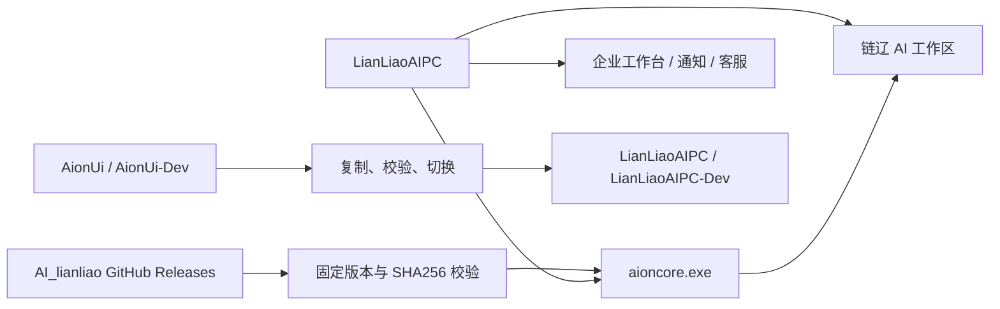

# 链辽桌面端与 AI Core 品牌、目录及发布迁移设计

## 1. 背景

当前仓库同时包含 Electron 桌面端 `AionUi` 与本地 Rust 服务 `AionCore`。链辽企业工作台、通知中心、客服与 AI 工作区均运行在 Electron 中，但项目目录、应用标识、本地数据目录、协议名称和 Core 下载源仍保留上游 AionUi 品牌或上游发布依赖。

本次迁移需要完成链辽品牌闭环，同时保证现有安装用户的本地数据库、AI 会话、技能、MCP 配置和升级链路不被破坏。

## 2. 已确认决策

| 项目 | 目标值 |
| --- | --- |
| 桌面端源码目录 | `LianLiaoAIPC` |
| Core 源码目录 | `LianLiaoAICore` |
| Windows 内部 Core 文件名 | `aioncore.exe` |
| 用户可见应用名称 | `链上辽宁·产业云城 AI桌面平台` |
| Electron App ID / Windows AUMID | `com.lianliao.app` |
| 正式版数据目录 | `LianLiaoAIPC` |
| 开发版数据目录 | `LianLiaoAIPC-Dev` |
| 开发多实例目录 | `LianLiaoAIPC-Dev-{序号}` |
| 新深链接协议 | `lianliao://` |
| 兼容的旧深链接协议 | `aionui://` |
| Core Release 仓库 | `https://github.com/zzy1136660162/AI_lianliao/releases` |

## 3. 目标

1. 将源码目录和用户可见品牌统一为链辽命名。
2. Windows 通知、任务栏、开始菜单、快捷方式和卸载项显示统一应用名称。
3. 修改 App ID 时保留旧安装器升级身份，避免已安装用户出现两个应用或无法覆盖升级。
4. 将本地数据迁移到链辽目录，并在任何失败情况下保留旧数据可回退。
5. 将桌面构建使用的 Core 下载源切换为链辽自己的 GitHub Releases。
6. 继续兼容现有 AionCore REST、WebSocket、SQLite、环境变量和托管资源契约。
7. 建立上游更新隔离机制，避免上游发布直接影响链辽用户。

## 4. 不在本次范围

- 不批量重命名 Rust crate、REST 路径、WebSocket 事件名或数据库表。
- 不重命名 `aioncore.exe`、现有 SQLite 数据库文件或内部 `AIONUI_*` 环境变量。
- 不自动删除旧的 `AionUi`、`AionUi-Dev` 数据目录。
- 不自动跟随上游 AionCore 最新版本。
- 不改变 cloud-api 企业业务接口、OpenID、客服和桌面通知协议。

这些内部标识保留是兼容性措施，不代表用户界面继续显示 AionUi 品牌。

## 5. 总体结构



## 6. 源码目录迁移

仓库内执行物理目录重命名：

```text
AionUi   -> LianLiaoAIPC
AionCore -> LianLiaoAICore
```

迁移时必须：

1. 先停止占用旧目录的 Electron、Vite、Node 和 Core 开发进程。
2. 确认源、目标均位于 `E:\ZZY_PROJECT\AI_lianliao`，且目标目录不存在。
3. 使用 Windows 原生文件移动完成目录重命名，保留工作区内所有已修改和未跟踪文件。
4. 更新构建脚本、测试、文档、IDE 配置和仓库内硬编码路径。
5. 不对与本需求无关的已有修改执行重置、删除或覆盖。

## 7. 桌面身份与安装升级

### 7.1 用户可见身份

以下位置统一显示 `链上辽宁·产业云城 AI桌面平台`：

- Electron 应用名称；
- BrowserWindow 与系统通知；
- Windows 任务栏和通知中心；
- 开始菜单、桌面快捷方式和卸载项；
- macOS 应用名称与通知来源；
- Linux desktop entry；
- 托盘菜单、关于页面和错误提示中的产品名称。

Electron 必须在创建任何窗口或系统通知前设置：

```text
app.setAppUserModelId("com.lianliao.app")
```

### 7.2 App ID 与安装器兼容

新的 `appId` 使用 `com.lianliao.app`。由于 electron-builder 的 NSIS 升级身份默认由 App ID 派生，直接修改可能造成旧版本无法覆盖升级。因此构建配置必须显式固定旧版安装器 GUID，使 App ID 更新与升级身份解耦。

发布前需验证：

- 从已安装旧版本直接安装新版本时完成覆盖升级；
- 控制面板和开始菜单不出现重复应用；
- 卸载入口只保留一个；
- 新版本通知来源显示链辽名称。

### 7.3 深链接协议

- 新安装注册 `lianliao://`。
- 继续注册并解析 `aionui://`，作为历史兼容协议。
- 新生成的链接只使用 `lianliao://`。
- 两种协议进入同一解析器，不维护两套业务逻辑。

## 8. 本地数据目录迁移

### 8.1 新目录

| 场景 | 目录名 |
| --- | --- |
| 正式版 | `LianLiaoAIPC` |
| 开发版 | `LianLiaoAIPC-Dev` |
| 第二开发实例 | `LianLiaoAIPC-Dev-2` |
| 后续开发实例 | `LianLiaoAIPC-Dev-{序号}` |

应用显示名称与数据目录名称必须解耦，不能依赖 `app.setName()` 隐式推导数据路径。

### 8.2 迁移触发条件

仅在以下条件同时满足时触发：

1. 新目录不存在或为空；
2. 对应旧目录存在；
3. 旧目录中存在可识别的数据库或配置文件；
4. 当前未检测到未完成的其他迁移进程。

### 8.3 迁移流程

1. 在新目录旁创建临时迁移目录。
2. 从旧目录复制文件，不移动、不删除旧文件。
3. 校验关键文件存在、文件大小一致，并尝试只读打开 SQLite 数据库。
4. 写入迁移元数据，记录来源、目标、时间、应用版本和校验结果。
5. 原子地将临时目录切换为正式新目录。
6. 启动 Core 并完成健康检查后，将迁移标记为成功。

如果任一步失败，应用继续使用旧目录或停止进入 AI 区域并展示可恢复错误；不得用不完整的新目录覆盖旧数据。

### 8.4 回退与清理

- 旧目录不自动删除。
- 重复启动时根据迁移标记实现幂等处理。
- README 提供人工回退和清理步骤。
- 日志不得输出账号令牌、模型密钥或数据库正文。

## 9. LianLiaoAICore 品牌边界

### 9.1 修改内容

- 源码项目目录；
- README、构建说明和发布说明；
- CLI 帮助、用户可见诊断标题与错误提示；
- Release 资产名称和清单中的品牌字段；
- 开发脚本中指向源码目录的路径。

### 9.2 保留内容

- `aioncore.exe` 文件名；
- 当前进程启动参数；
- REST 和 WebSocket 对外契约；
- SQLite 数据库文件名、表结构和迁移序号；
- MCP server 标识、技能 ID 和内置资源相对路径；
- 现有 `AIONUI_*` 兼容环境变量。

后续可以增加新的 `LIANLIAO_*` 环境变量别名，但在完成迁移周期前不能移除旧变量。

## 10. Core Release 与供应链规则

### 10.1 发布源

桌面端生产构建只从以下仓库获取 Core：

```text
https://github.com/zzy1136660162/AI_lianliao/releases
```

建议资产命名：

```text
lianliao-aicore-v{version}-x86_64-pc-windows-msvc.zip
lianliao-aicore-v{version}-x86_64-apple-darwin.tar.gz
lianliao-aicore-v{version}-aarch64-apple-darwin.tar.gz
lianliao-aicore-v{version}-x86_64-unknown-linux-gnu.tar.gz
SHA256SUMS
```

### 10.2 固定与校验

桌面端版本配置必须同时声明：

- Core 版本；
- GitHub 仓库；
- 各平台资产名；
- 各资产 SHA256；
- 允许的 Core API 兼容范围。

构建时如果资产缺失、版本不匹配或 SHA256 不一致，必须立即失败。正式构建不允许静默回退到 `iOfficeAI/AionCore` 或 `latest`。

本地开发可通过明确的环境变量选择本地 Core，但构建日志必须标明来源。

### 10.3 上游更新流程

```text
拉取上游变更
  -> 链辽集成分支评审
  -> SQLite 迁移与回退评估
  -> REST / WebSocket 契约验证
  -> Windows / macOS / Linux 构建
  -> 链辽 GitHub Release
  -> 更新桌面端固定版本与 SHA256
  -> 桌面端发布
```

上游仓库的 Release 不得直接成为链辽正式客户端的更新来源。

## 11. Electron 与 Core 兼容检查

Core 应提供或保留可读取的版本信息。Electron 在 Core 启动后检查：

- Core 版本；
- API 兼容版本；
- 数据库迁移状态；
- 托管资源准备状态。

若 Core 不兼容：

- 阻止进入链辽 AI 工作区；
- 展示明确的版本错误和日志位置；
- 企业工作台、企业库、产品库、在建项目、客服和通知中心仍可使用；
- 不自动下载未经固定和校验的 Core。

## 12. 文档与维护规则

必须更新或新增：

- 仓库根目录 README：项目结构、命名、开发入口和 Release 流程；
- `LianLiaoAIPC/README`：Electron 构建、数据迁移、App ID、协议和打包说明；
- `LianLiaoAICore/README`：Core 构建、资产命名和兼容边界；
- 两个项目的 `AGENTS.md`：禁止破坏兼容标识、禁止恢复上游下载源、修改品牌配置时的检查项；
- 已存在的交接文档和绝对路径引用。

文档中不得写入 GitHub Token、服务器密码、模型密钥或数据库凭据。

## 13. 实施顺序

1. 记录现有 Git 状态与运行进程。
2. 固化设计和详细实施计划。
3. 停止占用旧目录的开发进程。
4. 重命名两个源码目录并修复路径引用。
5. 实现应用身份和安装器兼容。
6. 实现数据目录迁移。
7. 实现新旧深链接协议兼容。
8. 调整 Core 用户可见品牌。
9. 切换 Core Release 下载源、固定版本与 SHA256 校验。
10. 更新 README、AGENTS 和交接文档。
11. 集中运行测试、构建、迁移和打包验证。

本任务按用户要求采用“先开发、后集中测试”，不采用 TDD；但完成声明前必须执行与风险相匹配的验证。

## 14. 验证与验收

### 14.1 静态与单元验证

- TypeScript 类型检查、Lint 和相关单元测试；
- Rust 格式检查、Clippy 和相关测试；
- 路径迁移、重复迁移、失败回退测试；
- Release URL、资产名和 SHA256 校验测试；
- 新旧深链接解析测试。

### 14.2 构建验证

- Electron 主进程与渲染进程构建；
- Windows x64 安装包构建；
- `aioncore.exe` 和托管资源完整性检查；
- 条件允许时验证 macOS 与 Linux 配置解析和 CI 构建。

### 14.3 升级与运行验收

- 旧版本覆盖升级后不产生第二个应用；
- 旧数据自动复制并可读取历史会话和配置；
- 迁移失败时旧数据保持完整；
- Windows 通知显示正确应用名称；
- 新旧深链接均可唤起应用；
- 企业工作台不依赖 Core 兼容检查；
- 正式构建只使用链辽 Release；
- SHA256 不一致时构建明确失败。

## 15. 风险控制

| 风险 | 控制措施 |
| --- | --- |
| 修改 App ID 导致重复安装 | 显式保留旧 NSIS GUID并进行覆盖升级验收 |
| 数据目录迁移丢失数据 | 只复制、校验后切换、保留旧目录 |
| Core 与 Electron 契约变化 | 固定版本、兼容范围和契约测试 |
| 上游 Release 直接影响用户 | 生产构建禁止上游回退 |
| Core 资产被替换 | 固定 SHA256，校验失败立即终止 |
| 目录重命名覆盖已有修改 | 重命名前记录状态，保留所有已修改和未跟踪文件 |
| 多平台名称不一致 | 在 Windows、macOS、Linux 构建配置中集中声明品牌常量 |
