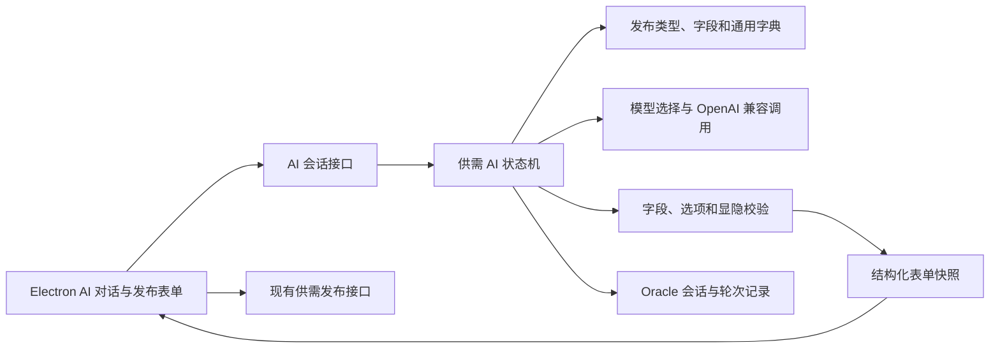

# 供需发布 AI 多轮业务识别与字段补全设计

更新日期：2026-07-28

## 1. 目标

在 Electron 的供需发布页面中增加一个可持续迭代的 AI 助手。用户可以先用自然语言描述需求，系统自动识别业务线；当业务线不明确时，先通过候选项或澄清问题确定业务线，再加载该业务线的数据库 Schema，逐轮补齐结构化字段。

本功能必须满足：

- 高置信度业务线可以自动确定，中低置信度必须由用户确认或继续澄清。
- 每轮最多询问 1～3 个相关问题，优先补齐必填字段。
- AI 对话区与结构化表单同时显示，每轮回答后实时回填表单。
- 用户可以随时手动修改字段，手动值优先于 AI 建议。
- 后续发现业务线可能错误时，只建议切换，不能静默切换。
- 必填字段齐全后生成完成度、待确认项和摘要，由用户手动提交审核。
- AI 不得直接发布数据，不得直接指定数据库列，也不得覆盖服务端可信身份字段。

## 2. 非目标

第一版不包含：

- H5 多轮 AI 发布页面。
- AI 自动提交或自动通过后台审核。
- 无限制自主 Agent 循环。
- 联系人、电话、企业身份等敏感字段的模型推断。
- 语音输入、附件内容识别和图片 OCR。
- 对现有一次性 `/DemandPublishController/parse` 接口的立即删除。

## 3. 已确认的交互决策

1. 高置信度业务线自动进入字段补全；中低置信度展示候选业务线或继续追问。
2. 每轮询问 1～3 个相关问题，通常在 2～4 轮内完成主要信息收集。
3. AI 对话区和结构化表单同时显示，表单实时反映 AI 解析结果。
4. 业务线纠错必须由用户确认；确认后保留通用字段，清空不兼容的专属字段。
5. 完成后由用户手动提交审核，AI 永不自动发布。

## 4. 方案选择

采用“服务端持久化状态机 + 数据库 Schema + 受约束模型调用”方案。

不采用单次大提示词，因为业务线分类、字段提取、缺失字段规划和纠错混在一次调用中难以验证，也无法可靠恢复会话。

不采用完整自主 Agent，因为当前目标有明确的 15 个业务类型和字段白名单。固定状态机更可控，延迟和成本也更稳定。

## 5. 总体架构



业务识别和字段补全继续使用 `J_CY_DEMAND_PUBLISH_TYPE`、`J_CY_DEMAND_PUB_FIELD`、`J_CY_BUSINESS_DICT` 与 `J_CY_BUSINESS_DICT_ITEM`。AI 只能读取当前启用的类型、字段和字典，不能在提示词或返回值中创造数据库列。

## 6. 会话状态机

状态定义：

| 状态 | 含义 | 允许的下一状态 |
|---|---|---|
| `DISCOVERING_LINE` | 根据用户描述识别业务线 | `CONFIRMING_LINE`、`COLLECTING_FIELDS` |
| `CONFIRMING_LINE` | 等待用户确认候选业务线或回答澄清问题 | `DISCOVERING_LINE`、`COLLECTING_FIELDS`、`CANCELLED` |
| `COLLECTING_FIELDS` | 按已确认 Schema 提取和补齐字段 | `CONFIRMING_SWITCH`、`REVIEW_READY`、`CANCELLED` |
| `CONFIRMING_SWITCH` | 后续信息与当前业务线冲突，等待确认切换 | `COLLECTING_FIELDS`、`CANCELLED` |
| `REVIEW_READY` | 必填字段齐全，等待用户检查和提交 | `COLLECTING_FIELDS`、`SUBMITTED`、`CANCELLED` |
| `SUBMITTED` | 用户已通过现有发布接口提交审核 | 终态 |
| `CANCELLED` | 用户取消会话 | 终态 |

每个用户输入只推进一次状态机并返回一次响应，不允许服务端自行无限循环。首次输入最多执行两次模型调用：一次业务识别，业务线高置信度时再执行一次字段提取。后续轮次通常只执行一次字段提取与问题规划。

## 7. 业务线识别

候选范围严格限制为当前允许发布的 15 个类型：

`0, 6, 7, 8, 11, 12, 13, 14, 15, 16, 17, 19, 21, 22, 27`

type 8 还需要识别：

- `ENTERPRISE_RECRUITMENT`
- `SERVICE_OUTSOURCING`
- `TRAINING_SERVICE`

识别分两层：

1. 服务端根据业务名称、字段标签、字典项和配置关键词构建候选摘要，缩小提示上下文。
2. 模型按固定 JSON 契约返回候选业务线、置信度、依据和澄清问题。

置信度规则：

- 第一候选置信度不低于 `0.85`，且与第二候选差值不低于 `0.20`：自动确定业务线。
- 第一候选置信度为 `0.55～0.85`，或候选差值不足 `0.20`：展示最多三个候选项供用户确认。
- 第一候选置信度低于 `0.55`：返回一个能够区分候选业务线的澄清问题。

模型给出的置信度只是输入。最终阈值、候选数量、允许类型和状态转换均由服务端控制。

## 8. 字段提取与多轮追问

业务线确认后，服务端加载该类型及子业务的完整 Schema。模型收到：

- 允许字段的 `fieldKey`、标签、输入类型和最大长度。
- 必填标记。
- 当前可见字段。
- 下拉或多选的有效字典值。
- 当前已填写值及其来源。
- 当前用户回答。

模型按固定 JSON 返回：

- 字段补丁。
- 每个补丁的置信度。
- 仍需确认的歧义。
- 对现有业务线的冲突信号。
- 下一轮建议追问的字段。

服务端依次执行：

1. 删除 Schema 中不存在的字段。
2. 校验字段当前是否可见。
3. 校验字典值、日期、数字、长度和配置正则。
4. 只应用空字段或此前来源为 AI 的字段。
5. 对用户手动字段产生冲突时记录警告，不自动覆盖。
6. 重新计算条件显隐和必填字段集合。
7. 选择最多三个语义相关的缺失字段生成下一轮问题。

追问按业务分组，避免一轮同时询问互不相关的内容。例如“采购数量、单位、规格参数”可以在同一轮询问，“详细地址、租售价格、图片”应拆分处理。

## 9. 字段所有权和版本

每个字段快照保存：

- `value`：当前值。
- `source`：`AI`、`MANUAL`、`SYSTEM`。
- `confidence`：AI 值的置信度，手动和系统值为空。
- `updatedTurn`：最后更新轮次。
- `locked`：手动修改后默认为锁定。

规则：

- `MANUAL` 和 `SYSTEM` 值优先级高于 `AI`。
- AI 可以更新自己此前生成的值，但不能覆盖锁定值。
- 用户明确表达“把预算改成……”时，服务端将其视为新的用户修改并更新对应字段。
- 企业名称、联系人、电话和登录身份始终由服务端生成，模型不可见也不可编辑。
- 表单提交继续使用现有发布服务重新执行完整校验，AI 会话结果不构成可信写入。

## 10. 业务线切换

后续输入与当前业务线明显冲突时，状态机进入 `CONFIRMING_SWITCH`，返回：

- 当前业务线。
- 建议切换的业务线及原因。
- 切换后会保留和清空的字段清单。

用户确认后：

- 保留 `title`、`summary`、`province`、`city`、`district`、`address`、`budget`、`endTime`。
- 清空原业务的动态字段。
- 加载新 Schema 并重新验证通用字段。
- 使用历史对话和保留字段做一次新业务字段提取。

用户拒绝时继续保留当前业务线，并把本次冲突记录为警告。

## 11. 数据库设计

cloud-api 在线上有双实例，会话状态不能只存在 JVM 内存。新增两张 Oracle 表：

### J_CY_DEMAND_AI_SESSION

| 字段 | 用途 |
|---|---|
| `SESSION_ID` | UUID 字符串主键 |
| `OPEN_ID` | Electron 登录身份 |
| `USER_ID`、`COMPANY_ID` | 创建时的可信身份快照 |
| `STATE` | 当前状态机状态 |
| `TYPE_ID`、`VARIANT_CODE` | 已确认业务线 |
| `LINE_CONFIDENCE` | 当前业务线置信度 |
| `FORM_VALUES_JSON` | 当前字段快照 |
| `MISSING_FIELDS_JSON` | 当前缺失必填字段 |
| `WARNINGS_JSON` | 待用户确认的警告 |
| `VERSION_NO` | 乐观锁版本 |
| `TURN_COUNT` | 已完成轮次 |
| `EXPIRES_TIME` | 会话过期时间 |
| `INPUT_TIME`、`UPDATE_TIME` | 创建和更新时间 |

### J_CY_DEMAND_AI_TURN

| 字段 | 用途 |
|---|---|
| `ID` | 序列主键 |
| `SESSION_ID` | 所属会话 |
| `TURN_NO` | 会话内轮次 |
| `REQUEST_ID` | Electron 生成的幂等键 |
| `USER_MESSAGE` | 用户本轮输入 |
| `ASSISTANT_ACTION_JSON` | 服务端返回的结构化动作 |
| `MODEL_CONFIG_ID` | 实际使用的模型配置 |
| `STATUS` | `SUCCESS`、`FAILED` |
| `LATENCY_MS` | 模型调用耗时 |
| `ERROR_CODE` | 脱敏后的错误分类 |
| `INPUT_TIME` | 创建时间 |

约束：

- `(SESSION_ID, TURN_NO)` 唯一。
- `REQUEST_ID` 唯一，重复请求返回原结果。
- `VERSION_NO` 使用乐观锁，防止双机或重复点击覆盖会话。
- 默认会话有效期为七天；过期会话只读，不再调用模型。
- API Key 不进入会话表、轮次表或日志。

## 12. API 设计

新增 `DemandAiConversationController`，继续由 Electron 主进程注入 `openId`。

### POST `/start`

请求：

```json
{
  "requestId": "uuid",
  "initialMessage": "需要采购200件不锈钢零件，一个月内交付"
}
```

创建会话并进入业务识别。

### POST `/turn`

请求：

```json
{
  "sessionId": "uuid",
  "requestId": "uuid",
  "version": 3,
  "message": "规格是304，单件直径20毫米"
}
```

处理后续自然语言回答。

### POST `/confirm-line`

由用户确认候选业务线或确认业务线切换。

```json
{
  "sessionId": "uuid",
  "requestId": "uuid",
  "version": 2,
  "typeId": 22,
  "variantCode": "DEFAULT",
  "confirmSwitch": false
}
```

### POST `/patch`

同步用户手动修改的字段。页面可以在控件失焦或短时间合并后发送，避免每次键盘输入都调用接口。

```json
{
  "sessionId": "uuid",
  "requestId": "uuid",
  "version": 4,
  "fields": {
    "budget": "10~50万元"
  }
}
```

### POST `/resume`

按 `sessionId` 恢复相同 openId 创建且未过期的会话；响应使用统一会话快照。

### POST `/cancel`

按 `sessionId + version` 将会话改为 `CANCELLED`，不删除审计记录。

统一响应：

```json
{
  "sessionId": "uuid",
  "version": 4,
  "state": "COLLECTING_FIELDS",
  "action": "ASK",
  "message": "请补充采购数量、单位和主要规格。",
  "lineDecision": {
    "typeId": 22,
    "variantCode": "DEFAULT",
    "confidence": 0.93,
    "candidates": []
  },
  "fieldPatch": {
    "title": "不锈钢零件采购"
  },
  "formValues": {
    "title": {
      "value": "不锈钢零件采购",
      "source": "AI",
      "confidence": 0.94,
      "updatedTurn": 1,
      "locked": false
    }
  },
  "missingRequiredFields": ["quantity", "productParameters"],
  "warnings": [],
  "completion": 0.62
}
```

`action` 支持：

- `ASK`
- `CONFIRM_LINE`
- `APPLY_PATCH`
- `CONFIRM_SWITCH`
- `REVIEW_READY`
- `RETRY_AVAILABLE`

## 13. 模型调用与故障切换

沿用 `J_CY_AI_MODEL_CFG` 的优先级和权重。每个模型都必须使用 OpenAI Chat Completions 兼容协议，并返回服务端定义的 JSON。

故障规则：

- `UnknownHostException`、`ConnectException`、超时和 HTTP 5xx：当前模型重试一次，再切换下一个启用模型。
- HTTP 401、403：不重试当前模型，记录配置错误并切换备用模型。
- HTTP 400 或模型输出无法通过 JSON 契约：使用一次更严格的修复提示；仍失败则切换备用模型。
- 所有模型失败时保留当前会话和已填表单，返回 `RETRY_AVAILABLE`，用户仍可手动填写。
- 不在日志中记录 API Key、完整提示词、完整用户原文和模型原始响应。

当前数据库只有一个启用模型。正式启用多模型故障切换前，应至少增加一个备用模型配置；没有备用模型时仍保留重试和手动降级。

## 14. Electron 页面设计

桌面宽度充足时：

- 左侧约 38%：AI 对话、候选业务线、澄清问题、完成度和重试操作。
- 右侧约 62%：现有动态发布表单。

较窄窗口下改为上下排列，AI 对话在表单上方。

页面行为：

- 首次进入显示大文本输入和“让 AI 帮我填写”。
- 业务线候选使用按钮或标签选择，不要求用户重新输入文字。
- AI 回填字段短暂高亮，并标记“AI 填写”。
- 用户修改后标记“已手动修改”，AI 不再自动覆盖。
- 页面顶部显示当前业务线和完成度。
- `REVIEW_READY` 时显示需求摘要、缺失的非必填信息和警告。
- 提交按钮始终调用原有发布接口；AI 会话接口不能提交审核。

## 15. 安全和数据边界

- Electron Renderer 不直接访问 cloud-api，继续通过主进程固定路由和 Zod 契约。
- `openId` 由主进程注入，服务端重新查询用户与企业关系。
- 模型提示词不包含 openId、userId、companyId、联系人或电话。
- 模型返回只允许 `fieldKey`，服务端根据元数据映射真实列。
- 字典、条件显隐、长度、日期和业务类型在服务端重新校验。
- 会话只能由相同 openId 恢复、修改或取消。
- 错误响应返回稳定错误码，不向 Electron 暴露模型密钥、代理内部地址或数据库异常。

## 16. 兼容和发布策略

- 保留现有 `/DemandPublishController/parse`，供旧 Electron 版本继续使用。
- 新客户端使用独立的会话接口，不改变现有发布接口请求格式。
- 通过 `DEMAND_AI_CONVERSATION_ENABLED` 控制新入口；关闭时回退到当前一次性解析或纯手工表单。
- 部署顺序：执行数据库脚本、部署 cloud-api、验证备用模型、发布 Electron。
- 双机 cloud-api 不需要粘性会话，因为状态和幂等记录均保存在 Oracle。

## 17. 测试范围

核心测试覆盖：

1. 高置信度业务线自动进入字段补全。
2. 中低置信度返回最多三个候选业务线。
3. 每轮问题不超过三个字段。
4. AI 不覆盖手动锁定字段。
5. 业务线切换只保留通用字段。
6. 字典值、条件显隐和必填字段由服务端校验。
7. 双机重复 `REQUEST_ID` 返回相同结果。
8. 乐观锁版本冲突返回可恢复响应。
9. 模型网络失败后重试、切换备用模型或降级手工填写。
10. Electron 同时更新对话区和结构化表单。
11. `REVIEW_READY` 不能自动发布。

端到端验证四条主路径：

- 明确采购需求直接识别并补齐字段。
- 模糊描述先确认业务线。
- 对话中确认切换业务线。
- 模型不可用时保留表单并继续手动填写。

## 18. 验收标准

- 明确业务描述能够在一次请求内完成业务线识别和第一轮字段回填。
- 模糊业务描述不会被静默归类，用户能够确认或继续澄清。
- 业务线确认后，所有回填字段都属于当前数据库 Schema。
- 用户手动修改的字段不会被后续 AI 回答覆盖。
- 必填字段齐全后生成摘要，但必须由用户手动提交审核。
- cloud-api 任一实例重启或请求切换到另一实例后，会话仍可继续。
- 模型、代理或网络失败不丢失当前表单内容。
- 现有 H5、旧 Electron 一次性解析和原发布接口不受影响。
