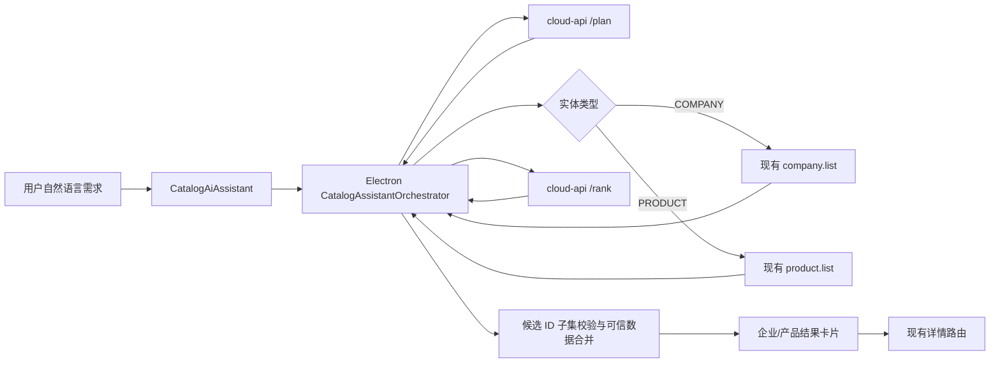

# 企业码与重点产品 AI 检索助手设计

## 文档状态

- 日期：2026-07-30
- 状态：已完成交互与架构确认，待用户审阅书面规格
- 适用范围：
  - Electron：`LianLiaoAIPC`
  - 服务端：`E:\ZZY_PROJECT\lianshang_liaoning\cloud-service\cloud-api`

## 背景

企业码和重点产品页面右侧目前只有“企业助手预留区”，不能根据自然语言帮助用户查找数据。新功能需要让用户直接描述目标，例如“找沈阳做精密机械加工的企业”或“查沈北新区的不锈钢加工产品”，由 AI 判断应检索企业还是产品、调用现有业务接口、有限翻页并筛选结果，最后以可点击卡片跳转到现有详情页。

企业数据规模约五十万条，不能让模型或客户端无上限遍历。首版采用“模型规划、业务接口检索、模型排序、客户端可信渲染”的分阶段方案，在保证检索过程可见的同时限制成本和延迟。

## 目标

1. 在企业码和重点产品页面提供同一个可复用的“产业检索助手”组件。
2. 不受当前页面类型限制，用户在任一页面都可以查询企业或产品。
3. 支持连续追问，例如“只看沈阳的”“换成重点产品”“再给我 3 家”。
4. 使用现有企业码、重点产品列表接口分页检索，不重复建设整套搜索接口。
5. 返回 3–6 条紧凑结果卡片，点击后进入已有企业码或重点产品详情页。
6. 对搜索页数、候选数量、模型输出和上下文长度设置硬限制。
7. 模型不可用时保留输入和候选数据，并提供明确的重试或确定性降级结果。

## 非目标

- 首版不建设向量数据库、全文检索集群或长期聊天记录。
- 首版不让 AI 直接生成或修改企业、产品业务数据。
- 首版不在结果卡片中展示联系人、电话等受会员权限控制的信息。
- 首版不新增批量 `IN` 查询接口；已分页获取的候选对象就是结果卡片的可信数据源。
- 首版不在企业码、重点产品以外的工作台页面启用该检索助手。

## 已确认的产品决策

### 跨页面识别

助手根据自然语言决定检索 `COMPANY` 或 `PRODUCT`。即使用户当前位于企业码页面，也可以返回重点产品；反之亦然。结果卡片按实体类型进入对应详情页。

### 有界检索

- 每页固定 20 条。
- 单轮最多检索 5 页。
- 单轮最多收集 100 个候选对象。
- 最终默认返回 3 条，最多返回 6 条。
- 用户需求过于宽泛、缺少可检索条件或实体类型无法确定时，先提出一个澄清问题，不启动翻页。

### 会话范围

会话只保存在当前 Electron 运行周期内。页面间跳转不清空会话，退出应用后自动清空，不写入长期聊天表。用户主动点击“清空会话”时立即清除当前上下文和结果。

### 分阶段编排

采用 Electron 分阶段编排：

1. `plan`：cloud-api 将自然语言转换成受支持的检索计划。
2. `search`：Electron 按计划调用现有企业或产品列表接口，最多翻 5 页。
3. `rank`：cloud-api 在最多 100 个紧凑候选中选择最匹配的 ID 并生成简短理由。
4. `render`：Electron 只使用已校验候选对象渲染结果，模型不能覆盖企业或产品事实字段。

该方案可以展示真实翻页进度，复用现有接口和校验逻辑，也为以后替换成向量检索保留清晰边界。

## 总体架构



### Electron 组件边界

1. `CatalogAiAssistant`
   - 负责输入区、示例问题、进度、澄清问题、结果卡片和重试交互。
   - 不直接请求网络，不包含企业或产品接口细节。

2. `CatalogAssistantProvider`
   - 位于企业路由内容之上，持有当前运行周期内的会话、最近结果和当前任务状态。
   - 保证从列表进入详情再返回时上下文不丢失。
   - 只在企业码和重点产品路由族中向助手提供检索能力，其他工作台页面继续显示现有通用预留内容。

3. `CatalogAssistantOrchestrator`
   - 执行 `plan → search → rank → render` 状态机。
   - 负责分页上限、候选去重、取消、旧请求隔离、确定性降级和进度事件。
   - 通过现有 `EnterpriseClient` 调用跨进程白名单操作。

4. `CatalogAssistantResultCard`
   - 根据 `COMPANY` 或 `PRODUCT` 渲染紧凑卡片。
   - 只消费规范化业务对象和模型生成的匹配理由。

建议把组件放在现有目录：

`packages/desktop/src/renderer/pages/enterprise/layout/catalog/assistant/`

这样不会扩大已经较繁杂的 `enterprise` 根目录，并清楚表达该助手服务于企业和产品目录。

### cloud-api 组件边界

1. `CatalogAiAssistantController`
   - 提供 `plan` 和 `rank` 两个接口。
   - 做参数、长度、数量和输出结构校验。

2. `CatalogAiAssistantService`
   - 组装系统提示、会话摘要和模型请求。
   - 约束模型只能使用受支持字段。
   - 复用现有 OpenAI 兼容传输、代理配置和模型故障转移机制。

3. `CatalogAiModelGateway`
   - 使用业务编码 `CATALOG_ASSISTANT` 查询 `J_CY_AI_MODEL_CFG`。
   - 按优先级、权重和失败状态切换模型。
   - 不与现有 `DEMAND_PARSE` 业务编码混用，避免两类提示词和故障统计互相影响。

4. DTO 与校验器
   - `plan`、`rank` 的输入输出使用独立 DTO。
   - Controller 不直接暴露数据库对象或通用 Map。

## 接口设计

接口路径遵循 cloud-api 现有 Controller 风格，Electron 主进程只允许调用固定白名单地址。

### 需求规划接口

建议操作名：`catalogAssistant.plan`

请求示例：

```json
{
  "message": "找沈阳做精密机械加工的企业",
  "context": {
    "lastEntityType": "COMPANY",
    "lastFilters": {
      "city": "沈阳市"
    },
    "lastResultCount": 3
  }
}
```

成功响应：

```json
{
  "entityType": "COMPANY",
  "filters": {
    "keyword": "精密机械加工",
    "industry": "",
    "city": "沈阳市",
    "district": ""
  },
  "resultLimit": 3,
  "clarification": null,
  "summary": "查找沈阳市从事精密机械加工的企业"
}
```

需要澄清时：

```json
{
  "entityType": null,
  "filters": {
    "keyword": "",
    "industry": "",
    "city": "",
    "district": ""
  },
  "resultLimit": 3,
  "clarification": "您想查找相关企业，还是重点产品？",
  "summary": "需要确认检索对象"
}
```

服务端约束：

- `message` 去除首尾空白后必须非空，并设置长度上限。
- `entityType` 只能是 `COMPANY`、`PRODUCT` 或澄清态的 `null`。
- 只接受 `keyword`、`industry`、`city`、`district` 四类筛选字段。
- `resultLimit` 强制归一到 3–6。
- 城市、区县沿用现有辽宁地区字段规则，不允许模型生成任意 SQL 条件。
- `clarification` 非空时 Electron 不调用列表接口。

### 候选排序接口

建议操作名：`catalogAssistant.rank`

请求包含原始需求、已确认计划和最多 100 条紧凑候选。候选只包含排序所需字段，不发送联系方式和大段富文本。

```json
{
  "message": "找沈阳做精密机械加工的企业",
  "plan": {
    "entityType": "COMPANY",
    "filters": {
      "keyword": "精密机械加工",
      "industry": "",
      "city": "沈阳市",
      "district": ""
    },
    "resultLimit": 3
  },
  "candidates": [
    {
      "id": "-8",
      "name": "示例企业",
      "industry": "机械加工",
      "region": "沈阳市 / 沈北新区",
      "summary": "精密机械零部件加工"
    }
  ]
}
```

响应示例：

```json
{
  "summary": "已找到 3 家与精密机械加工需求较匹配的沈阳企业。",
  "items": [
    {
      "id": "-8",
      "reason": "业务方向和所在地区均符合需求。"
    }
  ]
}
```

服务端和 Electron 双重约束：

- `items` 最多 6 条。
- ID 使用字符串传输，兼容现有非零有符号整数 ID，包括负数。
- 返回 ID 必须属于本次候选集合；未知 ID、重复 ID 和空 ID 直接丢弃。
- 模型只提供 `reason` 和整体 `summary`，不提供或覆盖名称、行业、地区、图片等事实字段。
- 理由限制为两行可读长度；过长内容由服务端截断后再由 UI 省略。

## 检索计划与现有接口映射

### 企业码

使用现有 `company.list`：

- `keyword` 映射企业名称或现有统一关键词参数。
- `industry` 映射所属行业。
- `city`、`district` 映射现有辽宁省市区筛选。
- 省份固定为辽宁省，不由模型决定。
- 分页从第 1 页开始，每页 20 条。

### 重点产品

使用现有 `product.list`：

- `keyword` 映射产品名称或现有统一关键词参数。
- `industry` 映射产品或企业行业筛选。
- `city`、`district` 映射现有辽宁省市区筛选。
- 省份固定为辽宁省。
- 分页从第 1 页开始，每页 20 条。

如果现有接口对某个字段不支持组合查询，首版忽略该非关键字段并在内部进度中标记为“已按可用条件检索”，不通过拼接新 SQL 绕过现有数据访问层。只有后续验证确实影响主要命中率时，才单独设计接口扩展。

## 编排状态机

单轮任务状态：

```text
IDLE
  → PLANNING
  → CLARIFYING | SEARCHING
  → RANKING
  → COMPLETED
  → FAILED | CANCELLED
```

### 状态行为

- `PLANNING`：显示“正在理解需求”。
- `CLARIFYING`：显示一个明确问题，保留输入和上下文，等待用户补充。
- `SEARCHING`：
  - 显示“已识别为企业码/重点产品”。
  - 显示“正在检索第 N/5 页”。
  - 显示“已收集 N 条候选”。
- `RANKING`：显示“正在筛选最匹配结果”。
- `COMPLETED`：显示两行以内摘要和 3–6 张结果卡片。
- `FAILED`：显示失败阶段和重试入口，不清空用户输入。
- `CANCELLED`：保留最近已完成结果，终止当前网络请求。

每轮任务分配唯一 `requestId`。所有异步回调提交状态前必须验证仍是当前 `requestId`，防止用户连续提交、切换页面或取消后，旧响应覆盖新结果。取消使用 `AbortController`；已发出的服务端请求即使无法物理中断，也不能再更新当前 UI。

分页在以下任一条件满足时停止：

- 已检索 5 页。
- 已收集 100 个去重候选。
- 接口返回空页。
- 已到达接口声明的最后一页。
- 用户取消。

## 多轮上下文合并

Provider 只保存有限的结构化上下文：

- 最近一次实体类型。
- 最近一次有效筛选条件。
- 最近一次请求的结果数量。
- 最近一轮用户需求和系统摘要。
- 最近结果 ID，仅用于“再给我几条”时避免立即重复。

追问合并规则：

- “只看沈阳的”：保留实体类型和其他条件，覆盖城市。
- “换成重点产品”：切换实体类型，保留仍适用于产品的地区和关键词条件。
- “再给我 3 家”：保持上轮计划，排除最近结果 ID，并把数量设为 3。
- 新问题明确改变主题时，以新问题为准，不机械叠加旧关键词。

为避免上下文膨胀，不把完整候选列表、富文本详情或长聊天记录发给 `plan`。模型收到的是结构化上下文和最近一轮摘要。

## UI 与交互

### 布局

- 展开宽度约 360px，替换当前 264px 的预留区宽度。
- 在窄窗口中以右侧抽屉覆盖内容区，不能把主列表压缩到不可用。
- 企业码与重点产品路由默认显示相同助手；其他企业工作台路由保留现有通用预留区。
- 输入框固定在底部，结果区独立滚动，避免拉长整个页面。

### 首屏

- 标题：`产业检索助手`
- 状态提示：`可查询企业码和重点产品`
- 提供 3 个可点击示例：
  - `找沈阳做精密机械加工的企业`
  - `查沈北新区的不锈钢加工产品`
  - `找能够提供包装印刷服务的企业`

### 对话与进度

助手不是完整聊天系统，只显示：

- 最近一轮用户需求。
- 必要的澄清问题。
- 当前真实执行阶段。
- 最近一轮摘要和结果。

不展示模型思维过程、提示词、内部评分或数据库查询细节。

### 结果卡片

企业卡片：

- 企业 Logo。
- 企业名称。
- 行业。
- 所在地区。
- 两行以内匹配理由。
- `查看企业码` 按钮。

产品卡片：

- 产品主图。
- 产品名称。
- 所属企业。
- 行业或所在地区。
- 两行以内匹配理由。
- `查看重点产品` 按钮。

卡片最多纵向显示 6 条。点击卡片或按钮使用现有路由：

- 企业：`/enterprise/companies/{companyId}`
- 产品：`/enterprise/products/{productId}`

进入详情不会清除会话；返回列表后仍能看到原结果。

### 操作

- `停止检索`：取消当前轮次。
- `重试`：从失败阶段重新执行；若计划已有效，搜索失败时无需重新调用 `plan`。
- `清空会话`：清除上下文、进度和结果，恢复首屏示例。

## 错误处理与降级

### 规划失败

- 显示“暂时无法理解检索需求，请重试”。
- 保留用户输入和上次结果。
- 不调用列表接口。

### 需求过宽或实体不明确

- 返回单个澄清问题。
- 不翻页、不调用排序。
- 用户补充后与有限结构化上下文合并。

### 列表分页失败

- 保留已经成功取得的候选。
- 首次失败提供重试当前页。
- 同一页连续失败后停止翻页；若已有候选则继续排序，否则显示列表服务暂不可用。

### 排序失败

- 使用现有业务接口顺序取前 3 条去重候选。
- 摘要固定为“已按检索条件返回结果”。
- 不伪造 AI 匹配理由，可显示“符合当前检索条件”。

### 无结果

- 显示“暂未找到符合条件的企业/产品”。
- 建议用户放宽地区或关键词。
- 不自动扩大到辽宁省外，不自动取消用户明确条件。

### 图片失败

沿用现有企业 Logo 和产品图片安全地址、占位图与域名白名单策略，不让模型返回图片 URL。

## 安全、隐私与诊断

- 渲染进程不直接访问 cloud-api；所有请求继续通过 preload、主进程桥接和固定路由白名单。
- 模型配置和 API 密钥只由 cloud-api 读取，不能进入 Electron 响应。
- 候选不发送联系人、电话、详细地址等受控字段给模型。
- 所有模型输出按 JSON 结构校验，不执行模型返回的路径、SQL、脚本或任意接口名。
- 正式环境默认不记录完整用户需求和模型响应。
- 仅在本地开发且显式设置 `LIANLIAO_DIAGNOSTIC_SENSITIVE=1` 时，允许把完整业务请求和模型响应写入本机滚动诊断日志。
- GitHub Token、SSH 密码、数据库凭据和模型/API 密钥在任何环境都不得写入代码、日志或文档。

## 模型配置

新增一份可人工执行的 SQL 脚本，为现有 `J_CY_AI_MODEL_CFG` 增加或配置业务编码 `CATALOG_ASSISTANT`。脚本随源码交付，但本次实现不自动执行、不修改外部数据库。

该业务编码复用现有能力：

- OpenAI 兼容协议。
- 代理配置。
- 模型优先级。
- 同优先级权重。
- 失败计数、熔断或状态切换。
- 主模型不可用时切换次级模型。

模型返回异常 JSON、超时或结构不合规，都按本轮失败处理并进入既定降级路径。

## 国际化

Electron 新增的标题、状态、示例、按钮、错误、空状态和卡片标签必须进入全部 10 个现有语言包，并重新生成 i18n 类型。中文是产品主语言，其他语言保持含义一致，不允许只补中文键导致运行时回退。

模型输出的匹配理由首版以用户输入语言为目标；如果模型没有遵守，则按原文展示，不在 Electron 内再次调用翻译模型。

## 测试范围

本功能采用“先开发、后测试”的交付顺序，不使用 TDD 驱动。实现完成后集中执行功能完整性测试和风险测试，不为简单展示文案、无分支样式或第三方组件内部行为补充大量低价值测试。

### cloud-api

功能完整性测试：

- `plan` 能识别企业与产品。
- 追问上下文能覆盖城市、切换实体和调整数量。
- 宽泛需求返回澄清问题，不生成空泛检索计划。
- `rank` 返回匹配结果并生成简短理由。

风险测试：

- 非法字段、非法实体类型和超出范围的数量被拒绝或归一化。
- `rank` 只返回候选集合内 ID，兼容负数 ID。
- 重复、未知、空 ID 被过滤。
- 模型优先级、权重和失败切换生效。
- 模型不可用、超时和异常 JSON 返回受控错误。

### Electron

功能完整性测试：

- 根据计划调用正确的 `company.list` 或 `product.list`。
- 多轮追问正确合并上下文。
- 企业和产品卡片进入正确详情路由。
- 页面跳转后会话仍保留，应用退出后不持久化。

风险测试：

- 每页 20 条、最多 5 页、最多 100 个候选、最多 6 个结果。
- 候选跨页去重。
- 用户取消后停止更新进度。
- 旧 `requestId` 响应不能覆盖新任务。
- 排序失败时返回确定性前 3 条。
- 助手结果区滚动不会拉长工作台页面。

### 集成冒烟

至少覆盖：

1. 企业查询：“找沈阳做精密机械加工的企业”。
2. 产品查询：“查沈北新区的不锈钢加工产品”。
3. 跨类型追问：“换成重点产品”。
4. 地区追问：“只看沈阳的”。
5. 宽泛问题触发澄清。
6. 模型排序不可用时仍返回业务接口结果。

## 验收标准

- 企业码和重点产品页面使用同一个助手组件，不复制两套业务逻辑。
- 用户不需要手动选择企业或产品，系统能够识别或发起澄清。
- 检索过程展示真实阶段和页码，不伪造进度。
- 任一轮检索不会超过 5 页或 100 个候选。
- 最终返回 3–6 条可点击卡片，事实字段来自现有接口而不是模型编造。
- 企业、产品和所有 ID 均兼容非零有符号整数。
- 单轮失败不清空输入、会话或最近成功结果。
- 模型不可用时有可用的确定性降级结果。
- Electron 不暴露模型密钥，不绕过主进程网络白名单。
- 实现顺序为先开发后测试，不采用 TDD。
- 受影响的 cloud-api 功能完整性与风险测试、服务编译、Electron 功能完整性与风险测试、类型检查、i18n 检查和构建验证全部通过后，才可声明开发完成。

## 复合产品关键词零结果修复

### 问题与数据证据

线上 `CompanyController/getFindProducts` 在同一组 `辽宁省 / 沈阳市 / 沈北新区` 条件下：

- 产品名称按“不锈钢加工”查询为 0 条。
- 产品名称按“不锈钢”查询为 192 条。

旧接口只对 `J_NEW_PRODUCTS.PRODUCTS_NAME` 做连续子串匹配。自然语言中的“加工”表达的是能力或工艺，但模型可能把“不锈钢加工”整体放入产品名称关键词，导致真实产品无法进入候选集合。

### 已确认设计

1. 第一轮仍使用模型给出的完整关键词，保持严格检索优先。
2. 完整关键词为产品检索且结果为零时，Electron 生成有界核心词回退：
   - `不锈钢加工产品` → `不锈钢`
   - `不锈钢加工件` → `不锈钢`
   - `不锈钢加工` → `不锈钢`
3. 回退只移除产品语境中位于结尾的“加工产品、加工服务、加工件、加工、产品、服务”等能力或泛化后缀；不修改词语中部，不进行任意分词。
4. 用户明确给出的省、市、区县必须原样保留，不能因为零结果自动扩大到其他区县。
5. 原始用户问题和原始模型计划继续传给排序接口。“加工”等被移出名称查询的能力信息仍由模型结合产品名称、产品简介、企业行业等候选字段排序。
6. 单轮搜索页数、候选数和结果数继续受现有上限约束；回退策略去重，不能重复请求同一组条件。
7. 首版不修改 cloud-api SQL，不新增全文检索接口。后续若仍有大量同义词漏召回，再单独设计覆盖产品名称、简介和企业经营范围的服务端检索接口。

### 补充验收

- “查沈北新区的不锈钢加工产品”严格查询为空后，会用“不锈钢”重试并返回候选。
- 回退请求仍包含 `province=辽宁省`、`city=沈阳市`、`district=沈北新区`。
- 企业检索不套用产品后缀规则。
- 已经能严格命中的产品关键词不会产生额外回退请求。
