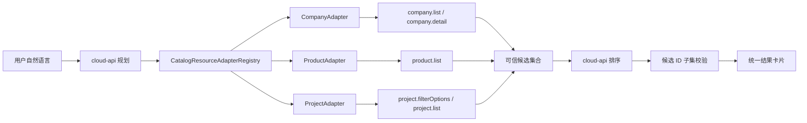

# 产业检索助手资源适配器与在建项目检索设计

## 文档状态

- 日期：2026-07-30
- 状态：已确认，进入开发
- Electron：`E:\ZZY_PROJECT\AI_lianliao\LianLiaoAIPC`
- 服务端：`E:\ZZY_PROJECT\lianshang_liaoning\cloud-service\cloud-api`

## 目标

把现有企业码、重点产品两条硬编码检索分支重构为资源适配器注册表，并新增 `PROJECT` 在建项目检索。用户仍通过一个产业检索助手连续提问；模型只负责规划和候选排序，企业、产品、项目事实字段必须来自现有业务接口。

## 已确认架构

每个适配器统一承担：

- 构造有界搜索策略；
- 查询一页权威业务数据；
- 提取稳定 ID；
- 生成不含联系方式的模型候选；
- 在当前结果中执行追问筛选；
- 把选中结果转换为可信结果；
- 按资源需要补充详情；
- 生成会话范围摘要。

编排器只负责状态机、分页上限、取消、重试、排序和降级，不再包含实体接口分支。

## 资源范围

- `COMPANY`：固定辽宁省，复用 `company.list`，选中后分批调用 `company.detail`。
- `PRODUCT`：固定辽宁省，复用 `product.list`，保留现有产品复合关键词有界回退。
- `PROJECT`：全国范围，复用 `project.filterOptions` 与 `project.list`；卡片点击进入 `/enterprise/projects/{hpInfoId}`。

## 项目检索字段

公共字段继续支持 `keyword`、`industry`、`province`、`city`、`district`。项目追加：

- `categoryL1`
- `categoryL2`
- `materialShortName`
- `materialName`
- `budgetRange`
- `constructionNature`
- `investmentType`
- `publishedFrom`
- `publishedTo`
- `minInvestment`
- `maxInvestment`

模型输出先通过 cloud-api 白名单和长度校验。项目适配器再通过 `project.filterOptions` 解析省份、城市、品类和材料选项：优先完全匹配，其次唯一包含匹配；没有可靠匹配时不伪造精确选项，而是保留到 `keyword` 进行宽检索。

相对时间由服务端按 `Asia/Shanghai` 和当前日期转换为绝对日期，Electron 只接收 `YYYY-MM-DD`。

## 会话与追问

会话仍仅在当前 Electron 运行周期保存。`currentScope` 增加项目结果摘要，支持：

- “其中沈阳的”：在当前项目结果内按地区缩小；
- “投资超过 5000 万的”：在当前项目结果内按投资额缩小；
- “换成在建项目”：切换为 `PROJECT` 并保留可复用关键词；
- “再来 6 个”：排除上一批 ID 后继续有界搜索。

模型不能扩大 `REFINE_CURRENT` 的当前结果集合。

## 安全与失败行为

- 单轮仍为每页 20 条、最多 5 页、最多 100 个候选。
- 默认展示 6 条，用户明确数量时最多 50 条。
- 排序结果只接受本轮候选中的 ID。
- 模型候选不包含联系人、电话、邮箱或详细地址。
- 项目选项接口失败时降级为关键词检索，不阻断项目列表调用。
- 项目列表失败时沿用现有重试状态；已有候选时继续排序。
- 排序失败时按权威接口顺序返回最多 6 条确定性结果。

## UI

助手标题保持“产业检索助手”，能力说明改为可查询企业码、重点产品和在建项目。增加项目示例、项目检索进度和项目结果卡片。项目卡片显示项目名称、地区、投资额、项目性质/建设性质、采购摘要和匹配理由，不展示受限联系方式。

## 验收标准

1. 编排器通过注册表选择资源，不再出现企业/产品/项目接口分支。
2. 三类资源均可完成规划、分页、排序、可信回填和详情跳转。
3. 在建项目支持全国地区及数据库选项解析。
4. 多轮追问可在项目当前结果中继续筛选或换一批。
5. 现有企业、产品检索和产品关键词回退行为不回归。
6. cloud-api 与 Electron 的结构校验、核心测试、类型检查、i18n 检查和构建通过。
7. 本次不执行数据库修改、不部署、不提交、不推送。
